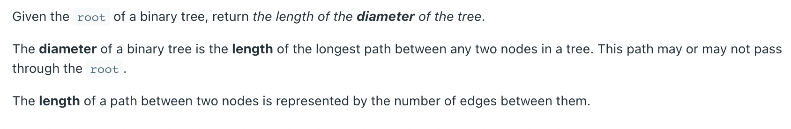
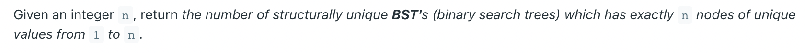

>   "@@@" - tech problem; "!!!" - cannot solve at the first time; "+++" - some useful trick; "///" - try later.

# Data Structure

## Array - Double Pointers

### Binary Search

#### 34. Find First and Last Position of Element in Sorted Array

*   

*   Thoughts:

    *   The nums is sorted in non-decreading order, so the brute force methord is traversing.
    *   If we traverse the nums, the time complexity is $O(n)$. To achieve $O(\log n)$ for a list, adopt binary search.
    *   Also, we need to run binary search twice to find the start and end. Cauze if we only find the start index and traverse to find the end index, the worst time complexity will be $O(n)$
    *   For binary search, we first decide the interval is open or closed. Closed interval: $[left, right]$
    *   $mid = left + ((right - left) >> 2)$
    *   For the closed interval and we want to return when we find the target, the condition for `while` should be `left <= right`
    *   the equation we used to narrow the search range leads to start and end index
    *   To find the start index: even the nums[mid] = target, we still need to narrow the range to the left side

*   Solution

    *   ```python
        class Solution:
            def searchRange(self, nums: List[int], target: int) -> List[int]:
                size = len(nums)
                # first we find start index
                left, right = 0, size - 1
                while left <= right:
                    mid = left + ((right - left) >> 2)
                    if nums[mid] > target:
                        right = mid - 1
                    elif nums[mid] < target:
                        left = mid + 1
                    elif nums[mid] == target:
                        right = mid - 1
                start = left
                if start < 0 or start >= size or nums[start] != target:
                    return [-1, -1]
                
                # then we find end index
                left, right = 0, size - 1
                while left <= right:
                    mid = left + ((right - left) >> 2)
                    if nums[mid] > target:
                        right = mid - 1
                    elif nums[mid] < target:
                        left = mid + 1
                    elif nums[mid] == target:
                        left = mid + 1
                end = right
                return [start, end]
        
        ```

    

#### 704. Binary Search

*   Basic one, no thought

*   Solution:

    *   ```python
        class Solution:
            def search(self, nums: List[int], target: int) -> int:
                left, right = 0, len(nums) - 1
                while left <= right:
                    mid = left + ((right - left) >> 2)
                    if nums[mid] < target:
                        left = mid + 1
                    elif nums[mid] > target:
                        right = mid - 1
                    elif nums[mid] == target:
                        return mid
                return -1
            
        ```

    *   

#### 35. Search Insert Position

*   Thought:

    *   Apply open interval cause we want the insert position which is exactly one index.

*   Solution:

    *   ```python
        class Solution:
            def searchInsert(self, nums: List[int], target: int) -> int:
                # open interval [left, right)
                left, right = 0, len(nums)
                while left < right:
                    mid = left + ((right - left) >> 2)
                    if nums[mid] < target:
                        left = mid + 1
                    elif nums[mid] > target:
                        right = mid
                    elif nums[mid] == target:
                        # return the target position
                        return mid
                # return the insert position
                return left
                
        ```

    *   

#### !!! 354. Russian Doll Envelopes

*   
*   Thoughts:
    *   Firstly, I'd like to sort the envelopes `envelopes.sort(key=lambda x:(x[0], -x[1]))` this coust $O(n\log n)$ in the worst case.
    *   Brute force search will cost $O(2^n)$.
    *   After sorting, this becomes dp problem. for each envelop, we give the maximum number it can contain. We can see that the subproblems are independent with each other. 
    *   dp: State "current_envelop"; selection: select the last envelop?
    *   ...
*   Solution
    *   The general dp is $O(n^2)$ exceeds the time limit.

#### 392. Is Subsequence

*   

*   Thoughts:

    *   At least traveser the father sequence. So the time complexity is $O(n)$

*   Solution:

    *   ```python
        class Solution:
            def isSubsequence(self, s: str, t: str) -> bool:
                s_pointer, t_pointer = 0, 0
                while s_pointer < len(s) and t_pointer < len(t):
                    s_char, t_char = s[s_pointer], t[t_pointer]
                    if s_char == t_char:
                        s_pointer += 1
                    t_pointer += 1
                if s_pointer == len(s):
                    return True
                return False
        ```

    *   

#### 793. Preimage Size of Factorial Zeroes Function

*   

*   Thoughts:

    *   1 zero -> 10 -> 2\*5 -> the \# of 2 is always bigger than the \# of 5.
    *   So we turn to find the \# of 5
    *   0!, 1!, 2!, 3!, 4!, has no 5
    *   5!, 6!, 7!, 8!, 9!, has one 5 
    *   10! 11!, 12!, 13!, 14! has two 5
    *   ...
    *   when it turn to 25!, 26!, ... it increases 2 at this time.
    *   for each k, the output is 0 or 5.
    *   if we increase count +=1 the time complexity is $O(k)$.
    *   How to make it better?
    *   Construct f(n)
    *   and binary search

*   Solution:

    *   time limit exceed:

    *   ```python
        class Solution:
            def preimageSizeFZF(self, k: int) -> int:
                multi = 0
                count = 0
                while count < k:
                    cur = multi * 5
                    while cur > 5 and cur % 5 == 0:
                        count += 1
                        cur = int(cur / 5)
                    multi += 1
                return 5 if count == k else 0
            
        ```

    *   !!!

    *   ```python
        class Solution:
            def f_n(self, n):
                multi = 5
                count = 0
                while multi <= n:
                    count += (n // multi)
                    multi = multi * 5
                return count
                
            def preimageSizeFZF(self, k: int) -> int:
                # if find the target, return 5; otherwise 0
                # [left_n, right_n)
                left_n = 0
                right_n = 5 * (k + 1)
                while left_n < right_n:
                    mid_n = left_n + ((right_n - left_n) >> 2)
                    cur_k = self.f_n(mid_n)
                    if cur_k == k:
                        return 5
                    elif cur_k < k:
                        left_n = mid_n + 1
                    elif cur_k > k:
                        right_n = mid_n
                return 0
        
        ```

    *   

#### 875. Koko Eating Bananas

*   

*   Thoughts:

    *   given the speed k, cost $O(n)$ to compute the h
    *   Can we try some reasonable k to meet h
    *   to find the minimum k -> binary search the left boundary.
    *   Can we give a search range at the very beginning? Yes, the greatest speed is the max(piles), this cost $O(n)$, at least speed k >= 1.
    *   how many k we need to check? not sure for now.

*   Solution:

    *   ```python
        class Solution:
            def compute_hours(self, piles: List[int], k: int) -> int:
                hour = 0
                for pile in piles:
                    hour += int(pile // k)
                    if pile % k != 0:
                        hour += 1
                return hour
                    
            def minEatingSpeed(self, piles: List[int], h: int) -> int:
                upper = max(piles) + 1
                # round down
                lower = 1
                # [lower, upper)
                # Note that the bigger k, the less hours
                while lower < upper:
                    mid = lower + ((upper - lower) >> 2)
                    hours = self.compute_hours(piles, mid)
                    # try to be sloer
                    if hours == h:
                        upper = mid
                    # could be slower
                    elif hours < h:
                        upper = mid
                    elif hours > h:
                        lower = mid + 1
                return lower
        
        ```

    *   

#### 1011. Capacity To Ship Packages Within D Days

*   

*   Thoughts:

    *   The days is inversely related to load: more we load the less days we spend
    *   Given the target day, find the mim load.
    *   Min days: 1; max load: sum(weights); $O(n)$
    *   Max days: len(weights); min load: max(weights) $O(n)$
    *   We need a func given the load, return days
    *   **We search for the most right days**
    *   we search for the min load given the days
    *   Follow the binary search principles I mentioned in data_structure.md

*   Solution:

    *   ```python
        class Solution:
            def compute_days(self, weights: List[int], load: int) -> int:
                days = 0
                ship = 0
                for weight in weights:
                    ship += weight
                    if ship > load:
                        days += 1
                        ship = weight
                days += 1
                return days
                
            def shipWithinDays(self, weights: List[int], days: int) -> int:
                # we search for the most right days
                # we search for the min load given the days
                # out of loads
                lower_load = max(weights)
                upper_load = sum(weights)
                # [lower_load, upper_load] closed interval
                while lower_load <= upper_load:
                    mid_load = lower_load + ((upper_load - lower_load) >> 2)
                    expected_days = self.compute_days(weights, mid_load)
                    # should decrease the load
                    if expected_days < days:
                        upper_load = mid_load - 1
                    # should increase the load
                    elif expected_days > days:
                        lower_load = mid_load + 1
                    # try to decrease the load
                    elif expected_days == days:
                        upper_load = mid_load - 1
                # loop ends when lower_load == upper_load - 1 && upper_load = mid_load - 1 and we want mid_load
                return upper_load + 1
            
        ```

    *   

### Sliding Window

#### 3. Longest Substring Without Repeating Characters

*   

*   Thoughts:

    *   We need to traverse the string $O(n)$
    *   can we traverse only once?
    *   we need a hashset window, whose find func cost $O(1)$
    *   we need left and right pointers /marks.

*   Solution:

    *   ```python
        class Solution:
            def lengthOfLongestSubstring(self, s: str) -> int:
                window = set()
                left = right = 0
                size = len(s)
                result = 0
                while right < size:
                    cur_char = s[right]
                    if cur_char not in window:
                        window.add(cur_char)
                        right += 1
                        continue
                    # cur_char is the repeating one
                    result = max(result, (right - 1) - left + 1)
                    while s[left] != cur_char:
                        window.remove(s[left])
                        left += 1
                    window.remove(s[left])
                    left += 1
                result = max(result, right - left)
                return result
        
        ```

    *   

#### 76. Minimum Window Substring

*   

*   Thoughts: 

    *   We need a dictionary of t
    *   So we first build a hash map (char: number)
    *   How can we find the min substring by travesing only once
    *   left and right pointers, create a window to record current string in s.
    *   We need a valid num to meet the number of char.
    *   The diff is once we meet the req, we need to shrink the left then we can get the result.
    *   $O(n+m)$ for n, we visit each char in s twice at most.

*   !!! Solution:

    *   ```python
        class Solution:
            def add_to_map(self, char: str, req: dict):
                if char not in req:
                    req[char] = 1
                elif char in req:
                    req[char] += 1
                
            def minWindow(self, s: str, t: str) -> str:
                req = dict()
                for char in t:
                    self.add_to_map(char, req)
                req_size = len(req)
                    
                window = dict()
                left_mark, size_mark = 0, len(s) + 1
                left = right = 0
                valid = 0
                
                while right < len(s):
                    char_right = s[right]
                    if char_right in req:
                        self.add_to_map(char_right, window)
                        if window[char_right] == req[char_right]:
                            valid += 1
                    # left need shrink?
                    while valid == req_size:
                        # update result
                        # will be removed
                        char_left = s[left]
                        if char_left in req:
                            if (window[char_left] == req[char_left]):
                                if (right - left + 1) < size_mark:
                                    left_mark = left
                                    size_mark = right - left + 1
                                valid -= 1
                            window[char_left] -= 1
                        left += 1
                    right += 1
                    
                if size_mark > len(s):
                    return ""
                
                return s[left_mark: left_mark + size_mark]
            
        ```

    *   

#### 438. Find All Anagrams in a String

*   

*   Thoughts:

    *   the order of p's letters is not important, so we store them in a hash map (letter: number)
    *   we traverse s with left and right pointers. The right one keep moving, and shrink the left one when the requirements meet.
    *   !!! **Note this one is different. the length of window is fixed.** 

*   Solution:

    *   ```python
        class Solution:
            def hash_add(self, hashmap: dict, key: str):
                if key not in hashmap:
                    hashmap[key] = 1
                else:
                    hashmap[key] += 1
                
            def findAnagrams(self, s: str, p: str) -> List[int]:
                need = dict()
                for char in p:
                    self.hash_add(need, char)
                
                left = right = 0
                window = dict()
                result = []
                need_num = len(need)
                valid = 0
                
                while right < len(s):
                    # for right pointer
                    char_right = s[right]
                    if char_right in need:
                        self.hash_add(window, char_right)
                        if window[char_right] == need[char_right]:
                            valid += 1
                    # for left pointer
                    while right - left + 1 >= len(p):
                        char_left = s[left]
                        if valid == need_num:
                            result.append(left)
                        if char_left in need:
                            if window[char_left] == need[char_left]:
                                valid -= 1
                            window[char_left] -= 1
                        left += 1
                    right += 1
                return result
                
        ```

    *   

#### 567. Permutation in String

*   

*   Thoughts:

    *   Permutation, in other words, the order is not important, so I will create a hashmap "need" for s1
    *   left and right pointers traverse s2 with a window, find out whether window meets need.
    *   the size of window is Len(s1)
    *   I will write a func for add letters to hashmap.

*   Solution:

    *   ```python
        class Solution:
            def hash_add(self, hashmap: dict, key: str):
                if key in hashmap:
                    hashmap[key] += 1
                else:
                    hashmap[key] = 1
                
            def checkInclusion(self, s1: str, s2: str) -> bool:
                need = dict()
                for char in s1:
                    self.hash_add(need, char)
                
                left = right = 0
                valid = 0
                need_num = len(need)
                window = dict()
                
                while right < len(s2):
                    char_right = s2[right]
                    if char_right in need:
                        self.hash_add(window, char_right)
                        if window[char_right] == need[char_right]:
                            valid += 1
                    
                    if right - left + 1 == len(s1):
                        char_left = s2[left]
                        if valid == need_num:
                            return True
                        if char_left in need:
                            if window[char_left] == need[char_left]:
                                valid -= 1
                            window[char_left] -= 1
                        left += 1
                    right += 1
                
                return False
            
        ```

    *   

#### 239. Sliding Window Maximum

*   

*   Thoughts:

    *   If we simplely move the window and find the max for each window, it cost $O(k * (n - k + 1))$. the worst one will be $O(n^2)$
    *   the window moves only one position, try to figure out how to reuse the infomation from the last movement.
    *   From the example, it seems that we need to know the descending order.
    *   A fact: a big item will overwhelm all smaller elements in the front of it. So we can crash them.
    *   A queue can meet the requirements. 
    *   Here is a problem, some great numbers should get removed if they are not in the window: remove the first item if it is in the queue before we move the window.
    *   **Note we cant smash the same val**
    *   *this is called monotonic stack*

*   /// Solution:

    *   ```python
        from collections import deque
        class Solution:
            def queue_add(self, queue: deque, val: int):
                # Note we cant smash the same val
                # it should be remove in line 19 and 20.
                while queue and queue[-1] < val:
                    queue.pop()
                queue.append(val)
                
            def maxSlidingWindow(self, nums: List[int], k: int) -> List[int]:
                queue = deque()
                # init
                for i in range(k - 1):
                    self.queue_add(queue, nums[i])
                result = []
                for i in range(k - 1, len(nums)):
                    self.queue_add(queue, nums[i])
                    result.append(queue[0])
                    if queue and queue[0] == nums[i + 1 - k]:
                        queue.popleft()
                    
                return result
            

### Else

#### 16. 

#### 26. 

#### 27. 

#### 283. 

#### 1099. 

#### 11. 

#### 42. 

#### 986. 

#### 15.

#### 18. 

#### 259.


## Linked List - Double Pointers

### 2. Add Two Numbers

*   

*   Thoughts:

    *   Traverse the two linked list at the same time. Since the digits are stored in reverse order, we can add each node and store the carry.
    *   And we create node for result in the same time.
    *   They may have different length. join the rest of it and dont forget the carry reminded.
    *   
    *   Note that after traversing l1 and l2, carry could be 1.

*   Solution:

    *   ```python
        # Definition for singly-linked list.
        # class ListNode:
        #     def __init__(self, val=0, next=None):
        #         self.val = val
        #         self.next = next
        class Solution:
            def addTwoNumbers(self, l1: Optional[ListNode], l2: Optional[ListNode]) -> Optional[ListNode]:
                carry = 0
                head = ListNode()
                dummy = head
                while l1 and l2:
                    val = l1.val + l2.val + carry
                    carry = 1 if val >= 10 else 0
                    head.next = ListNode(val % 10)
                    head = head.next
                    l1 = l1.next
                    l2 = l2.next
                while l1:
                    if carry != 0:
                        val = l1.val + carry
                        carry = 1 if val >= 10 else 0
                        head.next = ListNode(val % 10)
                        head = head.next
                        l1 = l1.next
                    elif carry == 0:
                        head.next = l1
                        break
                while l2:
                    if carry != 0:
                        val = l2.val + carry
                        carry = 1 if val >= 10 else 0
                        head.next = ListNode(val % 10)
                        head = head.next
                        l2 = l2.next
                    elif carry == 0:
                        head.next = l2
                        break
                if carry == 1:
                    while head.next:
                        head = head.next
                    head.next = ListNode(1)
                
                return dummy.next
                
        ```

    *   

### 19. Remove Nth Node From End of List

*   

*   Thoughts:

    *   At least we need to traverse the linked list, but we cant go back I think, it is time consuming.
    *   We can build two pointers slow and fast, and let the fast n nodes away from slow.
    *   Since we need to link father node and child node, we better let the slow.next be the one should be deleted.

*   Solution:

    *   ```python
        # Definition for singly-linked list.
        # class ListNode:
        #     def __init__(self, val=0, next=None):
        #         self.val = val
        #         self.next = next
        class Solution:
            def removeNthFromEnd(self, head: Optional[ListNode], n: int) -> Optional[ListNode]:
                dummy = ListNode()
                dummy.next = head
                slow = fast = dummy
                for i in range(n):
                    fast = fast.next
                while fast.next:
                    slow = slow.next
                    fast = fast.next
                # we need to delete slow.next
                child = slow.next.next
                slow.next = child
                
                return dummy.next
        
        ```

    *   

### 21. Merge Two Sorted Lists

*   

*   Thoughts: 

    *   cause they are both sorted. build a pointer for each of them and compare the pointers. move the smaller one.
    *   when one pointer reach the end, joint the other one to the end of result list.

*   Solution:

    *   ```python
        # Definition for singly-linked list.
        # class ListNode:
        #     def __init__(self, val=0, next=None):
        #         self.val = val
        #         self.next = next
        class Solution:
            def mergeTwoLists(self, list1: Optional[ListNode], list2: Optional[ListNode]) -> Optional[ListNode]:
                pointer1 = list1
                pointer2 = list2
                dummy = head = ListNode()
                while pointer1 and pointer2:
                    val1 = pointer1.val
                    val2 = pointer2.val
                    if val1 <= val2:
                        head.next = pointer1
                        pointer1 = pointer1.next
                    elif val2 < val1:
                        head.next = pointer2
                        pointer2 = pointer2.next
                    head = head.next
                if pointer1:
                    head.next = pointer1
                if pointer2:
                    head.next = pointer2
                    
                return dummy.next
            
        ```

    *   !!! Recursive one

    *   ```python
        class Solution:
            def mergeTwoLists(self, l1: Optional[ListNode], l2: Optional[ListNode]) -> Optional[ListNode]:
                if l1 is None:
                    return l2
                if l2 is None:
                    return l1
                if l1.val < l2.val:
                    l1.next = self.mergeTwoLists(l1.next, l2)
                    return l1
                else:
                    l2.next = self.mergeTwoLists(l1, l2.next)
                    return l2
                
        ```

    *   

### 23. Merge k Sorted Lists

*   

*   Thoughts:

    *   Similar to merge 2 sorted lists
    *   The point is how we can compare k pointers fast.
    *   !!! utilize the data structure priority queue / the min heap

*   Solution:

    *   Time $O(n\log k)$

    *   ```python
        # Definition for singly-linked list.
        # class ListNode:
        #     def __init__(self, val=0, next=None):
        #         self.val = val
        #         self.next = next
        from queue import PriorityQueue
        
        class Solution:
            def mergeKLists(self, lists: List[Optional[ListNode]]) -> Optional[ListNode]:
                # !!!
                setattr(ListNode, "__lt__", lambda self, other: self.val <= other.val)
                
                dummy = head = ListNode()
                pq = PriorityQueue()
                
                for lst in lists:
                    if lst != None:
                        pq.put(lst)
                
                while not pq.empty():
                    head.next = pq.get()
                    head = head.next
                    if head.next != None:
                        pq.put(head.next)
                
                return dummy.next
                
        ```

    *   I think we can also apply divide and conquer strategy. it is also $O(n \log k)$

### 141. Linked List Cycle

*   **Follow up:** Can you solve it using `O(1)` (i.e. constant) memory?

*   Solution:

    *   ```python
        class Solution:
            def hasCycle(self, head: Optional[ListNode]) -> bool:
                slow = fast = head
                while fast and fast.next :
                    slow = slow.next
                    fast = fast.next.next
                    if slow == fast:
                        return True
                return False
                
        ```

    *   

### 142. Linked List Cycle II

*   

*   Thoughts:

    *   With $O(1)$ space complexity to find whether there is a cycle, we use fast and slow pointers.
    *   To find the position, we need to dig into step they move.
    *   In the most cases, they won't meet at the right position
    *   After first meeting, put one pointer at the start node, move k - m steps at the same pace until they meet again.

*   Solution:

    *   ```python
        class Solution:
            def detectCycle(self, head: Optional[ListNode]) -> Optional[ListNode]:
                slow = fast = head
                has_cycle = False
                while fast and fast.next:
                    slow = slow.next
                    fast = fast.next.next
                    if slow == fast:
                        has_cycle = True
                        break
                if not has_cycle:
                    return None
                slow = head
                while slow != fast:
                    slow = slow.next
                    fast = fast.next
                return slow
                
        ```

    *   

### 160. Intersection of Two Linked Lists

*   

*   Thoughts:

    *   The difficulty is that they may not has the same size.
    *   Try to let two pointers meet after moving same steps.
    *   If we move m + n steps and still not meet, they won't meet.

*   Solution:

    *   Note the condition order is important

    *   ```python
        # Definition for singly-linked list.
        # class ListNode:
        #     def __init__(self, x):
        #         self.val = x
        #         self.next = None
        
        class Solution:
            def getIntersectionNode(self, headA: ListNode, headB: ListNode) -> Optional[ListNode]:
                pointerA = headA
                pointerB = headB
                # -1 means non-visited
                sizeA = sizeB = -1
                step = 1
                while True:
                    if not pointerA and sizeA == -1:
                        pointerA = headB
                        sizeA = step - 1
                    if not pointerB and sizeB == -1:
                        pointerB = headA
                        sizeB = step - 1
                    if pointerA == pointerB and pointerA:
                        return pointerA
                    if (step - 1) == (sizeA + sizeB):
                        return None
                    pointerA = pointerA.next
                    pointerB = pointerB.next
                    step += 1
                    
        ```

    *   /// this one is much clear

    *   ```python
        # Definition for singly-linked list.
        # class ListNode:
        #     def __init__(self, x):
        #         self.val = x
        #         self.next = None
        
        class Solution:
            def getIntersectionNode(self, headA: ListNode, headB: ListNode) -> Optional[ListNode]:
                pointerA = headA
                pointerB = headB
                while pointerA != pointerB:
                    if not pointerA:
                        pointerA = headB
                    else:
                        pointerA = pointerA.next
                    if not pointerB:
                        pointerB = headA
                    else:
                        pointerB = pointerB.next
                return pointerA
        
        ```

    *   

### 876. Middle of the Linked List

*   

*   Thoughts:

    *   Since for even \# of nodes we need the second middle node, it decide the end condition.

*   Solution:

    *   ```python
        class Solution:
            def middleNode(self, head: Optional[ListNode]) -> Optional[ListNode]:
                slow = fast = head
                # not fast: even
                # not fast.next: ood
                while fast and fast.next:
                    slow = slow.next
                    fast = fast.next.next
                return slow
                
        ```

    *   

### 25. Reverse Nodes in k-Group

*   

*   Thoughts:

    *   Find a way with $O(1)$ space complexity
    *   Think about the case with k > 2
    *   How can I know the \# of nodes is not a multiple of k?
        *   Record the start node, once traverse k nodes, reverse the list.
    *   

*   Solution:

    *   ```python
        # Definition for singly-linked list.
        # class ListNode:
        #     def __init__(self, val=0, next=None):
        #         self.val = val
        #         self.next = next
        class Solution:
            def reverse_list(self, start: ListNode, end: ListNode, k: int):
                pre = start.next
                start.next = end
                
                node = pre.next
                pre.next = end.next
                start = pre
                
                for i in range(1, k):
                    temp = node.next
                    node.next = pre
                    pre = node
                    node = temp
                return start
                
            def reverseKGroup(self, head: Optional[ListNode], k: int) -> Optional[ListNode]:
                dummy = ListNode()
                dummy.next = head
                count = 0
                start = dummy
                end = None
                while head:
                    count += 1
                    if count == k:
                        end = head
                        head = start = self.reverse_list(start, end, k)
                        count = 0
                    head = head.next
                return dummy.next
                
        ```

*   Other: !!! Recursive

    *   ```python
        # Definition for singly-linked list.
        # class ListNode:
        #     def __init__(self, val=0, next=None):
        #         self.val = val
        #         self.next = next
        class Solution:
            def reverse_list(self, start: ListNode, k: int):
                pre = None
                cur = nxt = start
                for i in range(k):
                    nxt = cur.next
                    cur.next = pre
                    pre = cur
                    cur = nxt
                return pre
                
            def reverseKGroup(self, head: Optional[ListNode], k: int) -> Optional[ListNode]:
                if not head:
                    return None
                start = end = head
                for i in range(k):
                    if not end:
                        return start
                    end = end.next
                new_head = self.reverse_list(start, k)
                start.next = self.reverseKGroup(end, k)
                return new_head
                
        ```

    *   

### 83. Remove Duplicates from Sorted List

*   

*   Thoughts:

    *   The link is sorted, so once we find a new val, delete all following nodes with same val.
    *   `-100 <= Node.val <= 100` init val_mark = -1000.
    *   and we can continue find the .next until we find the one different, then connect them.
    *   note the last node_mark

*   Solution:

    *   ```python
        # Definition for singly-linked list.
        # class ListNode:
        #     def __init__(self, val=0, next=None):
        #         self.val = val
        #         self.next = next
        class Solution:
            def deleteDuplicates(self, head: Optional[ListNode]) -> Optional[ListNode]:
                if not head:
                    return None
                dummy = head
                value = head.val
                node_mark = head
                while head:
                    if head.val != value:
                        node_mark.next = head
                        node_mark = head
                        value = head.val
                    head = head.next
                # note the end
                node_mark.next = None
                return dummy
                
        ```

    *   

### 92. Reverse Linked List II

*   
*   Thoughts:

    *   First we find the node in the front of left

*   Solution:

    *   ```python
        # Definition for singly-linked list.
        # class ListNode:
        #     def __init__(self, val=0, next=None):
        #         self.val = val
        #         self.next = next
        class Solution:
            def reverseBetween(self, head: Optional[ListNode], left: int, right: int) -> Optional[ListNode]:
                dummy = ListNode()
                dummy.next = head
                pointer = dummy
                for i in range(left - 1):
                    pointer = pointer.next
                # now the pointer is the father of left
                before = pointer
                pointer = pointer.next
                new_end = pointer
                pre = None
                cur = nxt = pointer
                for i in range(left, right + 1):
                    nxt = cur.next
                    cur.next = pre
                    pre = cur
                    cur = nxt
                behind = cur
                new_start = pre
                # connect them
                before.next = new_start
                new_end.next = behind
                
                return dummy.next
                
        ```

    *   


### 234. Palindrome Linked List

*   

*   Thoughts:

    *   To decide whether a whole linked list, we utilize stack, FILO
    *   How can we know when I or O. the point is we dont know the size, and the we can't decide it by stack.top()
    *   Stack is not good
    *   Use !!! fast-slow pointers to find the mid point, then reverse the right side list
    *   Note odd or even cases
    *   

*   Solution:

    *   ```python
        # Definition for singly-linked list.
        # class ListNode:
        #     def __init__(self, val=0, next=None):
        #         self.val = val
        #         self.next = next
        class Solution:
            def isPalindrome(self, head: Optional[ListNode]) -> bool:
                if not head.next:
                    return True
                # move the first step
                slow = head
                fast = head.next
                while fast and fast.next:
                    slow = slow.next
                    fast = fast.next.next
                # mark the mid pos
                mid = slow
                # reverse the list behind from mid
                pre = None
                cur = nxt = mid.next
                while cur:
                    nxt = cur.next
                    cur.next = pre
                    pre = cur
                    cur = nxt
                # pre is the new start
                first = head
                second = pre
                while second:
                    if first.val != second.val:
                        return False
                    first = first.next
                    second = second.next
                return True
                
        ```

    *   


## Prefix Sum

### 303. Range Sum Query - Immutable

*   Solution: 

    *   ```python
        class NumArray:
        
            def __init__(self, nums: List[int]):
                self.pre_sum = []
                self.pre_sum.append(nums[0])
                for i in range(1, len(nums)):
                    self.pre_sum.append(nums[i] + self.pre_sum[i-1])
                
        
            def sumRange(self, left: int, right: int) -> int:
                sum_val = self.pre_sum[right]
                if left > 0:
                    sum_val -= self.pre_sum[left - 1]
                return sum_val
        
        
        # Your NumArray object will be instantiated and called as such:
        # obj = NumArray(nums)
        # param_1 = obj.sumRange(left,right)
        
        ```

    *   

### /// 304. Range Sum Query 2D - Immutable

*   
*   Thoughts: 
    *   
    *   
*   Solution: 

### !!!327. Count of Range Sum

*   !!! 315 do this first

*   
*   Thoughts: 
    *   There are $n(n-1)/2$ possible ranges.
    *   So if we compute each range, the time will be at least $O(n^2)$
    *   How can we utilize info better? Sort? no, we need to keep the order
*   Solution: 

### 1352. Product of the Last K Numbers

*   Thoughts: 

    *   prefix to avoild $O(k)$ getProduct -> $O(1)$
    *   how about add(0) -> clear the prefix list if we meet zero

*   Solution: 

    *   ```python
        class ProductOfNumbers:
        
            def __init__(self):
                self.prefix = []
        
            def add(self, num: int) -> None:
                if num == 0:
                    # the last k (before num) products are always zero.
                    self.prefix.clear()
                    return
                if len(self.prefix) > 0:
                    self.prefix.append(num * self.prefix[-1])
                else:
                    self.prefix.append(num)
        
            def getProduct(self, k: int) -> int:
                size = len(self.prefix)
                if k > size:
                    return 0
                if k == size:
                    return self.prefix[-1]
                if k < size:
                    return int(self.prefix[-1] / self.prefix[-(k+1)])
        
        # Your ProductOfNumbers object will be instantiated and called as such:
        # obj = ProductOfNumbers()
        # obj.add(num)
        # param_2 = obj.getProduct(k)
        ```

    *   

## Differential Array

### 370.  

*   
*   Thoughts:
*   Solution

### 1094. Car Pooling

*   

*   Thoughts:

    *   for a trip, we need to add / minus a same number to a range of nums. so create a difference array, turn it to O(1) op. But we dont know the number of stations. we need to create a list(1001)

*   Solution: 

    *   ```python
        class Solution:
            def carPooling(self, trips: List[List[int]], capacity: int) -> bool:
                diff = [0] * 1001
                for num, start, end in trips:
                    diff[start] += num
                    diff[end] -= num
                result = 0
                for i in range(0, 1001):
                    result += diff[i]
                    if result > capacity:
                        return False
                return True
                
        ```

    *   

### 1109. Corporate Flight Bookings

*   

*   Thoughts:

    *   The repeative add for a range of array, apply diff array

*   Solution

    *   ```python
        class Solution:
            def corpFlightBookings(self, bookings: List[List[int]], n: int) -> List[int]:
                # the index start from one
                diff = [0] * (n + 1 + 1)
                for start, end, seats in bookings:
                    diff[start] += seats
                    diff[end + 1] -= seats
                result = [diff[1]]
                for i in range(2, n + 1):
                    result.append(result[i-1-1] + diff[i])
                return result
                
        ```

    *   

## Queue / Stack

### 20.Valid Parentheses

*   Thoughts:

    *   A stack
    *   Push ( { [, match ) } ]. 
    *   Note that if the stack is not empty after we traverse the string, return False

*   Solution

    *   ```python
        class Solution:
            def isValid(self, s: str) -> bool:
                stack = []
                match = {'(': ')', '{': '}', '[': ']'}
                for char in s:
                    if char in match:
                        stack.append(char)
                    else:
                        if not stack or match[stack.pop()] != char:
                            return False
                if stack:
                    return False
                return True
                   
        ```

    *   

### 921. Minimum Add to Make Parentheses Valid

*   

*   Thoughts:

    *   For each invalid '(' or ')', it needs an parenthesis.

*   Solution

    *   Space: O(n)

    *   ```python
        class Solution:
            def minAddToMakeValid(self, s: str) -> int:
                stack = []
                result = 0
                for char in s:
                    if char == '(':
                        stack.append(char)
                    else:
                        if not stack or stack[-1] != '(':
                            result += 1
                        else:
                            stack.pop()
                result += len(stack)
                return result
                
        ```

    *   Space O(1)

    *   ```python
        class Solution:
            def minAddToMakeValid(self, s: str) -> int:
                need = 0
                req = 0
                for char in s:
                    if char == '(':
                        need += 1
                    else:
                        need -= 1
                        if need == -1:
                            req += 1
                            need = 0
                return req + need
                
        ```

    *   

### 1541. Minimum Insertions to Balance a Parentheses String

*   

*   Thoughts:

    *   We need to keep the right one valid
    *   case analysis:
        *   if "(":
            *   need a '))'
        *   if ")":
            *   if the next char is ')'
            *   if the next char is not ')'

*   Solution

    *   ```python
        class Solution:
            def minInsertions(self, s: str) -> int:
                # need represent the stack
                need_right = 0
                lack_left = 0
                invalid = 0
                i = 0
                while i < len(s):
                    if s[i] == '(':
                        need_right += 1
                    elif s[i] == ')':
                        need_right -= 1
                        if need_right < 0:
                            need_right = 0
                            lack_left += 1
                        if i + 1 >= len(s) or s[i + 1] != ')':
                            invalid += 1
                        elif i + 1 < len(s) and s[i + 1] == ')':
                            i += 1
                    i += 1
                return need_right * 2 + lack_left + invalid
                
        ```

    *   

### !!! 32. Longest Valid Parentheses

*   
*   Thoughts:
    *   Stack and two pointers? 
    *   No! e.g. `"()(()"`
    *   DP
*   Solution

### 71. Simplify Path

*   

*   Thoughts:

    *   travese the string, divide dir and fire by '/'
    *   Stack

*   Solution:

    *   ```python
        class Solution:
            def simplifyPath(self, path: str) -> str:
                stack = []
                for cur_dir in path.split('/'):
                    if stack and cur_dir == '..':
                        stack.pop()
                    elif cur_dir not in ['', '.', '..']:
                        stack.append(cur_dir)
                return '/' + '/'.join(stack)
               
        ```

    *   

### 150. Evaluate Reverse Polish Notation

*   

*   Thoughts:

    *   Build a stack, once meet an op, stack pop the top 2 number, compute and push the result back.

*   Solution

    *   ```python
        class Solution:
            def evalRPN(self, tokens: List[str]) -> int:
                stack = []
                ops = ['+', '-', '*', '/']
                for token in tokens:
                    if token in ops:
                        num2 = stack.pop()
                        num1 = stack.pop()
                        if token == '+':
                            stack.append(num1 + num2)
                        elif token == '-':
                            stack.append(num1 - num2)
                        elif token == '*':
                            stack.append(num1 * num2)
                        elif token == '/':
                            stack.append(int(num1 / num2))
                    else:
                        stack.append(int(token))
                return stack.pop()
                
        ```

    *   

### /// 225. Implement Stack using Queues

*   
*   Thoughts:
*   Solution

### /// 232. 

*   
*   Thoughts:
*   Solution

### 239. 

*   
*   Thoughts:
*   Solution

## /// Binary Heap

## /// Data Structure Design


# Tree and Graph

## Binary Tree

*   **!!! 2 outline:**
    *   **Traverse the Tree: DFS / BFS**
    *   **Utilize the result of subtrees: DP**
*   **The point is what we should do at a single tree node.**

### 94. Binary Tree Inorder Traversal

*   

*   Thoughts:

*   Solution:

    *   ```python
        class Solution:
            def __init__(self):
                self.inorder = []
                
            def traverse(self, root: Optional[TreeNode]):
                if not root:
                    return
                self.traverse(root.left)
                self.inorder.append(root.val)
                self.traverse(root.right)
                
            def inorderTraversal(self, root: Optional[TreeNode]) -> List[int]:
                self.traverse(root)
                return self.inorder
                
        ```

    *   

### 100. Same Tree

*   

*   Thoughts:

*   Solution:

    *   ```python
        class Solution:
            def isSameTree(self, p: Optional[TreeNode], q: Optional[TreeNode]) -> bool:
                if not p and not q:
                    return True
                elif (not p and q) or (p and not q):
                    return False
                elif (p and q) and (p.val != q.val):
                    return False
                # elif (p and q) and (p.val == q.val):
                return self.isSameTree(p.left, q.left) and self.isSameTree(p.right, q.right)
                
        ```

    *   

### 102. Binary Tree Level Order Traversal

*   

*   Thoughts:

*   Solution:

    *   ```python
        from collections import deque
        class Solution:
            def levelOrder(self, root: Optional[TreeNode]) -> List[List[int]]:
                if not root:
                    return []
                queue = deque()
                queue.append(root)
                result = []
                while queue:
                    size = len(queue)
                    level = []
                    for i in range(size):
                        cur = queue.popleft()
                        level.append(cur.val)
                        if cur.left:
                            queue.append(cur.left)
                        if cur.right:
                            queue.append(cur.right)
                    result.append(level)
                return result
            
        ```

    *   

### /// 103. Binary Tree Zigzag Level Order Traversal

*   

*   Thoughts:

    *   FILO -> stack, creat a new stack for each level
    *   Queue append and pop from the different sides.

*   Solution

    *   ```python
        # Definition for a binary tree node.
        # class TreeNode:
        #     def __init__(self, val=0, left=None, right=None):
        #         self.val = val
        #         self.left = left
        #         self.right = right
        from collections import deque
        class Solution:
            def zigzagLevelOrder(self, root: Optional[TreeNode]) -> List[List[int]]:
                if not root:
                    return []
                result = []
                queue = deque()
                queue.append(root)
                # 0: left -> right; 1: right -> left
                # for cur level
                direction = 0
                while queue:
                    size = len(queue)
                    level = []
                    for i in range(size):
                        if direction == 0:
                            cur = queue.popleft()
                            level.append(cur.val)
                            if cur.left:
                                queue.append(cur.left)
                            if cur.right:
                                queue.append(cur.right)
                        elif direction == 1:
                            cur = queue.pop()
                            level.append(cur.val)
                            if cur.right:
                                queue.appendleft(cur.right)
                            if cur.left:
                                queue.appendleft(cur.left)
                    result.append(level)
                    direction = 1 if direction == 0 else 0
                return result
                
        ```

    *   

### 104. Maximum Depth of Binary Tree

*   

*   Thoughts:

*   Solution:

    *   DFS

    *   ```python
        class Solution:
            def __init__(self):
                self.depth = 0
                
            def traverse(self, root, depth):
                if not root:
                    self.depth = max(self.depth, depth - 1)
                    return
                self.traverse(root.left, depth + 1)
                self.traverse(root.right, depth + 1)
                
            def maxDepth(self, root: Optional[TreeNode]) -> int:
                self.traverse(root, 1)
                return self.depth
                
        ```

    *   ```python
        class Solution:
            def __init__(self):
                self.depth = 0
                
            def traverse(self, root, depth):
                if not root:
                    return
                self.depth = max(self.depth, depth + 1)
                self.traverse(root.left, depth + 1)
                self.traverse(root.right, depth + 1)
                
            def maxDepth(self, root: Optional[TreeNode]) -> int:
                self.traverse(root, 0)
                return self.depth
                
        ```

    *   

    *   !!! DFS (DP)

    *   ```python
        class Solution:
            def maxDepth(self, root: Optional[TreeNode]) -> int:
                if not root:
                    return 0
                left_max = self.maxDepth(root.left)
                right_max = self.maxDepth(root.right)
                return 1 + max(left_max, right_max)
                
        ```

    *   BFS

    *   ```python
        from collections import deque
        class Solution:
            def maxDepth(self, root: Optional[TreeNode]) -> int:
                if not root:
                    return 0
                queue = deque()
                queue.append(root)
                depth = 0
                while queue:
                    size = len(queue)
                    depth += 1
                    for i in range(size):
                        cur = queue.popleft()
                        if cur.left:
                            queue.append(cur.left)
                        if cur.right:
                            queue.append(cur.right)
                return depth
                
        ```

    *   

### 144. Binary Tree Preorder Traversal

*   

*   Thoughts:

*   Solution

    *   DFS

    *   ```python
        class Solution:
            def __init__(self):
                self.preorder = []
                
            def traverse(self, root):
                if not root:
                    return
                self.preorder.append(root.val)
                self.traverse(root.left)
                self.traverse(root.right)
                
            def preorderTraversal(self, root: Optional[TreeNode]) -> List[int]:
                self.traverse(root)
                return self.preorder
            
        ```

    *   Subtree: DP

    *   Space consuming

### 543. Diameter of Binary Tree

*   

*   Thoughts:

    *   for each node, the longest path include the max_depth of left and right
    *   need a function return max depth of the tree. - > DP
    *   For each node, we have 2 choices (contain the root or not)
    *   Or we can traverse the tree -> DFS

*   Solution

    *   DP (not good, cause we can solve the problem when we find the max_depth):

    *   ```python
        class Solution:
            def max_depth(self, root) -> int:
                if not root:
                    return 0
                left = self.max_depth(root.left)
                right = self.max_depth(root.right)
                return 1 + max(left, right)
                
            def diameterOfBinaryTree(self, root: Optional[TreeNode]) -> int:
                if not root:
                    return 0
                left = self.diameterOfBinaryTree(root.left)
                right = self.diameterOfBinaryTree(root.right)
                return max((self.max_depth(root.left) + self.max_depth(root.right)), max(left, right))
            
        ```

    *   DFS (much better here)

    *   ```python
        class Solution:
            def __init__(self):
                self.diameter = 0
                
            def max_depth(self, root) -> int:
                if not root:
                    return 0
                left = self.max_depth(root.left)
                right = self.max_depth(root.right)
                self.diameter = max(self.diameter, left + right)
                return 1 + max(left, right)
            
            def diameterOfBinaryTree(self, root: Optional[TreeNode]) -> int:
                self.max_depth(root)
                return self.diameter
              
        ```

    *   

### 105. Construct Binary Tree from Preorder and Inorder Traversal

*   

*   Thoughts:

    *   **unique** values. !
    *   use index as parameter, avoiding copy list
    *   !!! `.index` can be replaced by check in a hashmap

*   Solution

    *   ```python
        class Solution:
            # closed interval
            def build(self, preorder, pre_start, pre_end, inorder, in_start, in_end):
                if pre_start > pre_end:
                    return None
                root_val = preorder[pre_start]
                root = ListNode(root_val)
                in_mid = inorder.index(root_val)
                left_size = in_mid - 1 - in_start + 1
                right_size = in_end - (in_mid + 1) + 1
                root.left = self.build(preorder, pre_start + 1, pre_start + 1 + left_size - 1, inorder, in_start, in_mid - 1)
                root.right = self.build(preorder, pre_end - right_size + 1, pre_end, inorder, in_mid + 1, in_end)
                return root
                
            def buildTree(self, preorder: List[int], inorder: List[int]) -> Optional[TreeNode]:
                size = len(preorder)
                return self.build(preorder, 0, size - 1, inorder, 0, size - 1)
                
        ```

    *   

### 106. Construct Binary Tree from Inorder and Postorder Traversal

*   

*   Thoughts:

*   Solution

    *   ```python
        class Solution:
            def build(self, inorder, in_start, in_end, postorder, post_start, post_end):
                if in_start > in_end:
                    return None
                root_val = postorder[post_end]
                root = ListNode(root_val)
                in_mid = inorder.index(root_val)
                left_size = in_mid - 1 - in_start + 1
                right_size = in_end - (in_mid + 1) + 1
                root.left = self.build(inorder, in_start, in_mid - 1, postorder, post_start, post_start + left_size - 1)
                root.right = self.build(inorder, in_mid + 1, in_end, postorder, post_end - 1 - right_size + 1, post_end - 1)
                return root
                
            def buildTree(self, inorder: List[int], postorder: List[int]) -> Optional[TreeNode]:
                size = len(inorder)
                return self.build(inorder, 0, size - 1, postorder, 0, size - 1)
                
        ```

    *   !!! not a universal way

    *   ```python
        class Solution:
            def __init__(self):
                self.hashmap = {}
                self.inorder = []
                self.postorder = []
                
            def build(self, start, end):
                if start > end:
                    return None
                node_value = self.postorder.pop()
                node_index = self.hashmap[node_value]
                
                # right before left!
                right = self.build(node_index + 1, end)
                left = self.build(start, node_index - 1)
                
                return TreeNode(node_value, left, right)
                
            def buildTree(self, inorder: List[int], postorder: List[int]) -> Optional[TreeNode]:
                self.inorder, self.postorder = inorder, postorder
                self.hashmap = {}  
                for index, value in enumerate(inorder):
                    self.hashmap[value] = index
                    
                return self.build(0, len(self.inorder) - 1)
                
        ```

    *   

### 654. Maximum Binary Tree

*   

*   Thoughts:

*   Solution:

    *   ```python
        class Solution:
            def find_max(self, nums, start, end):
                max_i, max_val = -1, -1
                for i in range(start, end + 1):
                    if nums[i] > max_val:
                        max_i = i
                        max_val = nums[i]
                return max_i, max_val
            
            def construct(self, nums, start, end):
                if start > end:
                    return None
                index, root_val = self.find_max(nums, start, end)
                root = ListNode(root_val)
                root.left = self.construct(nums, start, index - 1)
                root.right = self.construct(nums, index + 1, end)
                return root
                
            def constructMaximumBinaryTree(self, nums: List[int]) -> Optional[TreeNode]:
                return self.construct(nums, 0, len(nums) - 1)
                    
        ```

    *   

### 107. Binary Tree Level Order Traversal II

*   Same one
*   Thoughts:
*   Solution

### 111. Minimum Depth of Binary Tree

*   

*   Thoughts:

    *   BFS is better here, it can stop earlier 

*   Solution

    *   ```python
        from collections import deque
        class Solution:
            def minDepth(self, root: Optional[TreeNode]) -> int:
                if not root:
                    return 0
                queue = deque()
                queue.append(root)
                depth = 0
                while queue:
                    size = len(queue)
                    depth += 1
                    for i in range(size):
                        cur = queue.popleft()
                        if not cur.left and not cur.right:
                            return depth
                        if cur.left:
                            queue.append(cur.left)
                        if cur.right:
                            queue.append(cur.right)
                return depth
                
        ```

    *   

### /// 114. Flatten Binary Tree to Linked List

*   

*   Thoughts:

    *   **Actually this is postorder!**

    *   1.   DP: a function return the start node and end node. / 

        *   Selection: if (not) root.left and if (not) root.right (4 selections)

    *   2.   Traversal solution is similar

    *   

*   Solution

    *   DP / postorder

    *   ```python
        class Solution:
            def flatten_helper(self, root):
                if not root:
                    return None, None
                left_start, left_end = self.flatten_helper(root.left)
                right_start, right_end = self.flatten_helper(root.right)
                root.left = None
                if left_start and right_start:
                    root.right = left_start
                    left_end.right = right_start
                    return root, right_end
                elif not left_start and right_start:
                    root.right = right_start
                    return root, right_end
                elif left_start and not right_start:
                    root.right = left_start
                    return root, left_end
                else:
                    return root, root
                
            def flatten(self, root: Optional[TreeNode]) -> None:
                """
                Do not return anything, modify root in-place instead.
                """
                self.flatten_helper(root)
                
        ```

    *   Traversal!!!

    *   ```python
        # Definition for a binary tree node.
        # class TreeNode:
        #     def __init__(self, val=0, left=None, right=None):
        #         self.val = val
        #         self.left = left
        #         self.right = right
        class Solution:
            def flatten(self, root: Optional[TreeNode]) -> None:
                """
                Do not return anything, modify root in-place instead.
                """
                if not root:
                    return
                self.flatten(root.left)
                self.flatten(root.right)
                
                left = root.left
                right = root.right
                
                root.left = None
                root.right = left
                
                temp = root
                while temp.right:
                    temp = temp.right
                temp.right = right
                
        ```

    *   

### 116. Populating Next Right Pointers in Each Node

*   

*   Thoughts:

    *   a perfect binary tree
    *   BFS connect to previous node

*   Solution

    *   ```python
        from collections import deque
        class Solution:
            def connect(self, root: 'Optional[Node]') -> 'Optional[Node]':
                if not root:
                    return None
                dummy = root
                queue = deque()
                queue.append(root)
                while queue:
                    size = len(queue)
                    cur = queue.popleft()
                    # this is a perfect bt
                    if cur.left:
                        queue.append(cur.left)
                        queue.append(cur.right)
                    pre = cur
                    for i in range(1, size):
                        cur = queue.popleft()
                        # this is a perfect bt
                        if cur.left:
                            queue.append(cur.left)
                            queue.append(cur.right)
                        pre.next = cur
                        pre = cur
                return dummy
                
        ```

    *   Other? ///

### 226. Invert Binary Tree

*   

*   Thoughts:

    *   Postorder / DP

*   Solution

    *   ```python
        class Solution:
            def invertTree(self, root: Optional[TreeNode]) -> Optional[TreeNode]:
                if not root:
                    return None
                left = self.invertTree(root.left)
                right = self.invertTree(root.right)
                root.left = right
                root.right = left
                return root
              
        ```

    *   

### 145. Binary Tree Postorder Traversal

*   Given the `root` of a binary tree, return *the postorder traversal of its nodes' values*.

*   Thoughts:

    *   

*   Solution

    *   ```python
        class Solution:
            def __init__(self):
                self.result = []
                
            def traverse(self, root):
                if not root:
                    return
                self.traverse(root.left)
                self.traverse(root.right)
                self.result.append(root.val)
                
            def postorderTraversal(self, root: Optional[TreeNode]) -> List[int]:
                self.traverse(root)
                return self.result
            
        ```

    *   

### 222. Count Complete Tree Nodes

*   

*   Thoughts:

*   Solution

    *   ```python
        from collections import deque
        class Solution:
            # BFS
            def countNodes(self, root: Optional[TreeNode]) -> int:
                if not root:
                    return 0
                queue = deque()
                count = 0
                queue.append(root)
                while queue:
                    size = len(queue)
                    for i in range(size):
                        cur = queue.pop()
                        count += 1
                        if cur.left:
                            queue.append(cur.left)
                        if cur.right:
                            queue.append(cur.right)
                return count
                
        ```

    *   /// have a math method

### 236. Lowest Common Ancestor of a Binary Tree

*   

*   Thoughts:

    *   All `Node.val` are **unique**.
    *   thought about dp. for each node we already finish the jobs on left and right.

*   Solution

    *   My way

    *   ```python
        class Solution:
            def __init__(self):
                self.father = None
                
            def traverse(self, root, p, q):
                if not root:
                    return False, False
                left_has_p, left_has_q = self.traverse(root.left, p, q)
                right_has_p, right_has_q = self.traverse(root.right, p, q)
                has_p = has_q = False
                if left_has_p or right_has_p or root.val == p.val:
                    has_p = True
                if left_has_q or right_has_q or root.val == q.val:
                    has_q = True
                if has_p and has_q and self.father == None:
                    self.father = root
                return has_p, has_q
                
            def lowestCommonAncestor(self, root: 'TreeNode', p: 'TreeNode', q: 'TreeNode') -> 'TreeNode':
                self.traverse(root, p, q)
                return self.father
                
        ```

    *   others

    *   ```python
        class Solution:
            def lowestCommonAncestor(self, root: 'TreeNode', p: 'TreeNode', q: 'TreeNode') -> 'TreeNode':
                if not root:
                    return None
                if root == p or root == q:
                    return root
                left = self.lowestCommonAncestor(root.left, p, q)
                right = self.lowestCommonAncestor(root.right, p, q)
                if left and right:
                    return root
                else:
                    return left if right == None else right
                
        ```

    *   

### 297. Serialize and Deserialize Binary Tree

*   
*   Thoughts: Traversal
*   Solution

    *   +++DFS

    *   ```python
        class Codec:
            def serialize_helper(self, root, json):
                if not root:
                    json.append('#')
                    return
                # reverse the preorder traversal
                self.serialize_helper(root.right, json)
                self.serialize_helper(root.left, json)
                json.append(str(root.val))
        
            def serialize(self, root):
                """Encodes a tree to a single string.
                
                :type root: TreeNode
                :rtype: str
                """
                json = []
                self.serialize_helper(root, json)
                return ",".join(json)
                
            def deserialize_helper(self, json):
                # wont get empty
                cur_val = json.pop()
                if cur_val == '#':
                    return None
                root = TreeNode(int(cur_val))
                root.left = self.deserialize_helper(json)
                root.right = self.deserialize_helper(json)
                return root
        
            def deserialize(self, data):
                """Decodes your encoded data to tree.
                
                :type data: str
                :rtype: TreeNode
                """
                json = data.split(',')
                return self.deserialize_helper(json)
        
        # Your Codec object will be instantiated and called as such:
        # ser = Codec()
        # deser = Codec()
        # ans = deser.deserialize(ser.serialize(root))
        ```

    *   

    *   /// BFS


### 341. Flatten Nested List Iterator

*   
*   Thoughts:

    *   +++ add a dummy head for all (sub) list, turn the list to a poly tree

*   Solution

    *   ```python
        class NestedIterator:
            def __init__(self, nestedList: [NestedInteger]):
                self.nested_list = []
                # dummy head
                for sub_list in nestedList:
                    self.build_helper(sub_list)
                self.cur_index = -1
                self.size = len(self.nested_list)
            
            def build_helper(self, nestedList: [NestedInteger]):
                if nestedList.isInteger():
                    self.nested_list.append(nestedList.getInteger())
                for sub_list in nestedList.getList():
                    self.build_helper(sub_list)
            
            def next(self) -> int:
                if self.hasNext():
                    self.cur_index += 1
                    return self.nested_list[self.cur_index]
                return -1
            
            def hasNext(self) -> bool:
                if self.cur_index + 1 < self.size:
                    return True
                return False
        
        # Your NestedIterator object will be instantiated and called as such:
        # i, v = NestedIterator(nestedList), []
        # while i.hasNext(): v.append(i.next())
        ```

    *   


### /// 501. Find Mode in Binary Search Tree

*   
*   Thoughts:

    *   **Follow up:** Could you do that without using any extra space? (Assume that the implicit stack space incurred due to recursion does not count).

*   Solution

    *   ```python
        class Solution:
            def __init__(self):
                self.max_count = 0
                self.cur_count = 0
                self.pre = None
                self.result = []
                
            def traverse(self, root):
                if not root:
                    return
                self.traverse(root.left)
                # inorder
                if self.pre and self.pre.val == root.val:
                    self.cur_count += 1
                else:
                    self.cur_count = 1
                if self.cur_count == self.max_count:
                    self.result.append(root.val)
                elif self.cur_count > self.max_count:
                    self.result.clear()
                    self.result.append(root.val)
                    self.max_count = self.cur_count
                self.pre = root
                self.traverse(root.right)
                
            def findMode(self, root: Optional[TreeNode]) -> List[int]:
                self.traverse(root)
                return self.result
                
        ```

    *   


### 559. Maximum Depth of N-ary Tree

*   
*   Thoughts:

    *   Dfs or bfs, I prefer bfs here cause it can stop earlier 

*   Solution

    *   ```python
        from collections import deque
        class Solution:
            def maxDepth(self, root: 'Node') -> int:
                if not root:
                    return 0
                queue = deque()
                queue.append(root)
                depth = 0
                while queue:
                    size = len(queue)
                    for i in range(size):
                        cur = queue.popleft()
                        for child in cur.children:
                            queue.append(child)
                    depth += 1 
                return depth
                
        ```

    *   


### 589. N-ary Tree Preorder Traversal

*   
*   Thoughts:
*   Solution

    *   ```python
        class Solution:
            def __init__(self):
                self.result = []
                
            def traverse(self, root):
                self.result.append(root.val)
                for child in root.children:
                    self.traverse(child)
            
            def preorder(self, root: 'Node') -> List[int]:
                if not root:
                    return []
                self.traverse(root)
                return self.result
                
        ```

    *   


### 590. 

*   
*   Thoughts:
*   Solution

    *   ```python
        class Solution:
            def __init__(self):
                self.result = []
                
            def traverse(self, root):
                for child in root.children:
                    self.traverse(child)
                self.result.append(root.val)
            
            def postorder(self, root: 'Node') -> List[int]:
                if not root:
                    return []
                self.traverse(root)
                return self.result
                
        ```

    *   


### 652. Find Duplicate Subtrees

*   
*   Thoughts:
*   Solution

    *   ```python
        from collections import defaultdict
        class Solution:
            def __init__(self):
                self.hashmap = defaultdict(list)
                
            def traverse(self, root):
                if not root:
                    return "#"
                sequence = "%s,%s,%s" % (str(root.val), self.traverse(root.left), self.traverse(root.right))
                self.hashmap[sequence].append(root)
                return sequence
            
            def findDuplicateSubtrees(self, root: Optional[TreeNode]) -> List[Optional[TreeNode]]:
                self.traverse(root)
                return [self.hashmap[sequence][0] for sequence in self.hashmap if len(self.hashmap[sequence]) > 1]
                
        ```

    *   


### 965. Univalued Binary Tree

*   
*   Thoughts:
*   Solution:

    *   ```python
        from collections import deque
        class Solution:
            def isUnivalTree(self, root: Optional[TreeNode]) -> bool:
                uni_val = root.val
                queue = deque()
                queue.append(root)
                while queue:
                    size = len(queue)
                    for i in range(size):
                        cur = queue.popleft()
                        if cur.val != uni_val:
                            return False
                        if cur.left:
                            queue.append(cur.left)
                        if cur.right:
                            queue.append(cur.right)
                return True
                
        ```

    *   


## Binary Search Tree

### !!! 95. Unique Binary Search Trees II

*   

*   Thoughts:

*   Solution:

    *   ```python
        class Solution:
            def __init__(self):
                self.result = []
            
            def traverse(self, start, end):
                if start > end:
                    return [None]
                sub_tree = []
                for root_val in range(start, end + 1):
                    left_trees = self.traverse(start, root_val - 1)
                    right_trees = self.traverse(root_val + 1, end)
                    for left in left_trees:
                        for right in right_trees:
                            root = TreeNode(root_val)
                            root.left = left
                            root.right = right
                            sub_tree.append(root)
                return sub_tree
                
            def generateTrees(self, n: int) -> List[Optional[TreeNode]]:
                return self.traverse(1, n)
                
        ```

    *   

### !!! 96. Unique Binary Search Trees

*   

*   Thoughts:

    *   this is a dp question. state is \# of nodes, selection is the \# of left and right nodes. Base case is 0 and 1

*   Solution:

    *   ```python
        class Solution:
            def numTrees(self, n: int) -> int:
                dp = [0] * (n + 1)
                dp[0] = 1
                dp[1] = 1
                for num in range(2, n + 1):
                    for left_num in range(num):
                        right_num = num - 1 - left_num
                        dp[num] += dp[left_num] * dp[right_num]
                return dp[n]
             
        ```

    *   

### !!! 98. Validate Binary Search Tree

*   

*   Thoughts:

    *   the left_max and right_min

*   Solution:

    *   ```python
        class Solution:
            def traverse(self, root, left_max, right_min):
                if not root:
                    return True
                if (left_max and left_max.val >= root.val) or (right_min and root.val >= right_min.val):
                    return False
                return self.traverse(root.left, left_max, root) and self.traverse(root.right, root, right_min)
                
            def isValidBST(self, root: Optional[TreeNode]) -> bool:
                return self.traverse(root, None, None)
                
        ```

    *   

### 450. 

*   
*   Thoughts:
*   Solution:

### 700. 

*   
*   Thoughts:
*   Solution:

### 701. 

*   
*   Thoughts:
*   Solution:

### 230. 

*   
*   Thoughts:
*   Solution:

### 538. 

*   
*   Thoughts:
*   Solution:

### 1038. 

*   
*   Thoughts:
*   Solution:

### 501. 

*   
*   Thoughts:
*   Solution:

### 503. 

*   
*   Thoughts:
*   Solution:

### 783. 

*   
*   Thoughts:
*   Solution:

### 1373. 

*   
*   Thoughts:
*   Solution:


## Graph

*   
*   Thoughts:
*   Solution:


# Search

## Backtrack

## DFS

## BFS


# Dynamic Programming

## 1D DP

## 2D DP

## Knapsack Problem


# Else

## Math

## Interval


