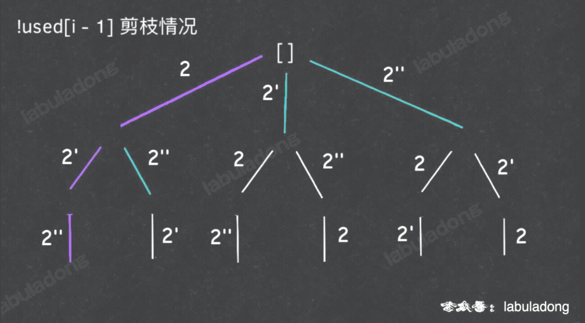
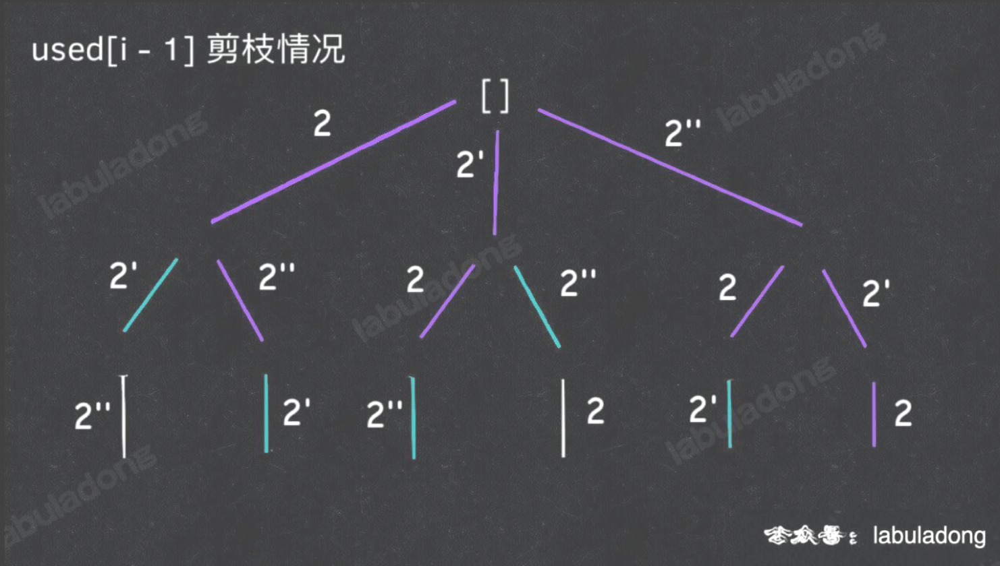

# Array & Linked List

*   Two Pointers
*   Binary search
    *   Open Interval / Closed Interval decides the condition ($<$ or $\leq$) in `while` and `right = len()` or `right = len()-1`
    *   `while` determines when it ends.
    *   `left = mid + 1 or mid` (`right = mid - 1 or mid`) depend on the search interval.
    *   `mid = left + ((right - left) >> 1)`: prevent int overflow.
    *   !!! **For even \# interval, the open one returns the latter position; the closed one returns the former position**
        *   **For open interval,  returning the latter position means the left is the \# that less than target!**
            *   **Left boundary: left == right && return left or right if possible (the last op is right = mid, where mid == right == left, and we want mid)**
            *   **Right boundary: left == right && return left - 1 or right - 1 if possible (the last op is left = mid + 1, where mid == right == left, and we want mid)**
        *   **For closed interval, ...**
            *   **Left boundary: left == right + 1 && return right + 1 or left if possible (the last op is right = mid - 1, where mid == right == left, and we want mid)**
            *   **Right boundary: left - 1 == right && return right or left - 1 if possible (the last op is left = mid + 1, where mid == right == left, and we want mid)**
    *   
*   PreSum
*   *Monotonic Stack* (increasing or decreasing)
*   Monotonic Queue

    *   ```python
        class MonotonicQueue:
            def push():
            def pop():
            def max/min():
        ```


# Binary Tree

*   Outline

    >   What we do for each node, and when?

    *   Traverse -- Backtracking
    *   Sub-problem -- DP
        *   Create trees.

*   Traverse:

    *   Preorder: Know info from father nodes
    *   Postorder: Know info from child nodes
        *   To get info from sub-tree,  we need postorder one.

*   Merge sort: Postorder traverse


# BST

*   Framework

    *   ```python
        def BST(self, root, target)
            if root.val == target:
            	...
            if root.val < target:
            	self.BST(root.right, target)
            if root.val > target:
            	self.BST(root.left, target)
                
        ```

    *   

*   Operations
    *   Delete: 450
    *   Insert: 701
    *   Search: 700
*   Quick sort: Preorder traverse / **Create a BST**


# Graph Theory


# Method of Exhaustion

## DFS

*   At each node, consider:

    1.   Path: the choices made
    2.   Selection list: avaibale choices
    3.   End condition

*   ```python
    result = []
    def backtrack(path, selection_list):
        if end condition:
            result.append(path)
            return
        for selection in selection_list:
            make decision
            
           	backtrack(cur_path, cur_selection_list)
            
            withdraw decision
    
    ```

    *    `make decision` is like preorder traverse (do sth before entering the node), and `withdraw decision` is like postorder traverse (do sth before leaving the node).

*   Different perspectives lead to different solutions. (leetcode 698)

*   A set of problems (permutation and combination):

    *   Type

        1.   Subset (unique, non-duplicate): 78
             1.   **fun parameter `start`**
             2.   `self.backtrack(track, nums, i + 1)`
        2.   Combination (unique, non-duplicate): 77
        3.   Permutation (unique, non-duplicate): 46
             1.   Subset / Combination (not unique, non-duplicate): 90 / 40, *add pruning*
                  1.   Not unique but asking for non-duplicate: **sort `nums`** 
        4.   Permutation (not unique, non-duplicate): 47
        5.   Subset / Combination (unique, allow duplicate): 39
             1.   fun parameter `start`,
             2.   `self.backtrack(track, nums, i)`

    *   Frameworks

        1.   Unique & Non-duplicate:

             *   Subsets / Combination: `start = i + 1`

                 *   ```python
                     	def backtrack(self, track: List[int], nums: List[int], start: int):
                             
                             end condition
                             
                             for i in range(start, len(nums)):
                                 val = nums[i]
                                 track.append(val)
                                 # here is the point
                                 self.backtrack(track, nums, i + 1)
                                 track.pop()
                     ```

             *   Permutation: `used[]`

                 *   ```python
                     	def backtrack(self, nums: List[int], track: List[int], used: List[bool]):
                             
                             end condition
                             
                             for i, num in enumerate(nums):
                                 # here is the point
                                 if not used[i]:
                                     used[i] = True
                                     track.append(num)
                                     self.backtrack(nums, track, used)
                                     used[i] = False
                                     track.pop()
                     ```

        2.   Not unique & Non-duplicate

             *   Subsets / Combination: `nums.sort` & `start` & `i > start and val == nums[i - 1]` & `start = i + 1`

                 *   ```python
                     nums.sort(reverse=True)
                         def backtrack(self, track: List[int], nums: List[int], start: int):
                             
                             end condition
                             
                             for i in range(start, len(nums)):
                                 val = nums[i]
                                 # here is the point
                                 if i > start and val == nums[i - 1]:
                                     continue
                                 track.append(val)
                                 self.backtrack(track, nums, i + 1)
                                 track.pop()
                     ```

             *   Permutation: `visited[]` and `visited[i] or (i > 0 and nums[i] == nums[i - 1] and not visited[i-1]):` (==not visited[i-1]==)

                 *   ```python
                     def backtrack(self, track, nums, visited):
                         
                         end condition
                         
                         for i, val in enumerate(nums):
                             # here is the point
                             if visited[i] or (i > 0 and nums[i] == nums[i - 1] and not visited[i-1]):
                                 continue
                             track.append(val)
                             visited[i] = True
                             self.backtrack(track, nums, visited)
                             track.pop()
                             visited[i] = False
                     ```

        3.   Unique & Allow duplicate

             *   Subsets / Combination: `start = i`

                 *   ```python
                     	def backtrack(self, track: List[int], nums: List[int], start: int):
                             
                             end condition
                             
                             for i in range(start, len(nums)):
                                 val = nums[i]
                                 track.append(val)
                                 # here is the point
                                 self.backtrack(track, nums, i)
                                 track.pop()
                     ```

             *   Permutation:

                 *   ```python
                     	def backtrack(self, nums: List[int], track: List[int]):
                             
                             end condition
                             
                             for i, num in enumerate(nums):
                                 # here is the point
                                 track.append(num)
                                 self.backtrack(nums, track, used)
                                 track.pop()
                     ```

        4.   Not unique & Allow duplicate

             *   no point

    *   **Tricks**

        1.   **If the problem asks for subsets (including p/c with k elements), we need a fun parameter `start`.**
        2.   Not unique but asking for non-duplicate: 
             1.   add pruning (some conditions)
                  1.   **Subsets / Combination: sorting `nums`  and pruning `i > start and nums[i] == nums[i-1]`**
                  2.   **Permutate all elements: sorting `nums`  and pruning `visited[i] or (i > 0 and nums[i] == nums[i-1] and !used[i - 1])` or record the previous num.**
                       1.   `!used[i - 1]` return the same result as `used[i - 1]`, but it is better.
                       2.   
                       3.   
        3.   

## BFS

>   usually for finding the most value. DFS can also do that, but it has to visit all nodes. However, BFS usually spend more space.


# Dynamic Programming

>   Usually find the most value. Compare with method of exhaustion (BFS), DP has optimal substructure.

*   Base case + (State + Selection) -- (State Equation)
*   For overlapping: `memos`

*   Two structure

    *   Top-down

        ```python
        def dp(state1, state2, ...):
        	for selection in selections:
                result = find_target(result, dp(state1, ...))
            return result
        ```

        

    *   Bottom-up

        ```python
        dp[0][0][...] = base case
        
        for state1 in states1:
            for state2 in states2:
                for ...
                	dp[state1][state2][...] = find_target(selection1, selection2)
        ```

*   Some important value

    *   Invalid
    *   Unvisited

*   Optimal substructure asks the ==subproblems are independent with each other.==

*   To find the overlapping, draw the recursive tree.

*   **The State Equation decides the loop order of bottom up**

*   Time complexity:

    *   **Top-down: the # of subproblem \* the T of subproblem**

*   -

# Later

*   Sort
    *   Merge sort: Postorder traverse
        *   Stable sort
        *   Time: $O(n\log n)$
    *   Quick sort: Preorder traverse / **Create a BST**
        *   Unable sort.
        *   Ideal: Time $O(n\log n)$; Space: $O(\log n)$
        *   Worst: Time $O(n^2)$; Space: $O(n)$
*   Hard
    *   315
    *   327
*   *dp game*
    *   174.   Dungeon Game
    *   514. Freedom Trail
    *   
    
*   -

