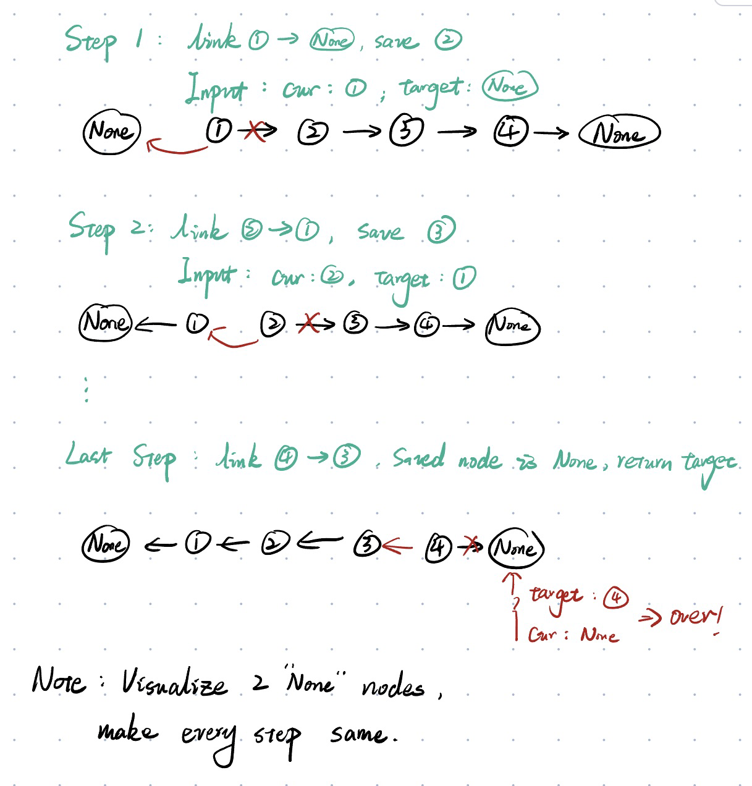
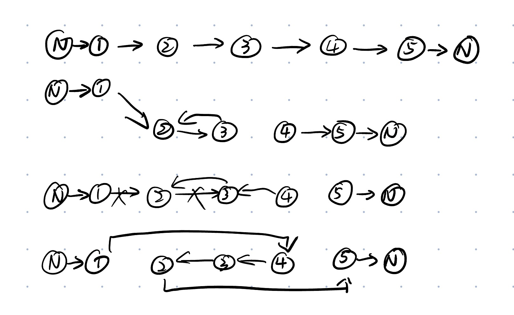

>   "@@@" - tech problem; "!!!" - cannot solve at the first time; "+++" - some useful trick; "///" - try later.

## 05.31

### 303. Range Sum Query - Immutable

>   Prefix sum **array**.

*   Time Complexity: $O(n)$

*   Space Complexity: $O(1)$

*   ```python
    class NumArray:
    
        def __init__(self, nums: List[int]):
            self.pre_sum = nums  # pass by pointer
        
            for i in range(len(nums)-1):
                self.pre_sum[i+1] += self.pre_sum[i]
    
        def sumRange(self, left: int, right: int) -> int:
            if left == 0:
                return self.pre_sum[right]
            
            return self.pre_sum[right] - self.pre_sum[left-1] 
    ```

### 304. Range Sum Query 2D - Immutable

>   Prefix sum **Matrix**.

*   Time Complexity: $O(m*n)$
*   Space Complexity: $O(1)$


###  1109. Corporate Flight Bookings

>   Diff Array.

*   Time Complexity: $O(n)$

*   Space Complexity: $O(n)$

*   ```python
    class Solution:
        def __init__(self):
            self.diff = []
            
        def book_flight(self, begin, end, num):
            self.diff[begin] += num
            if end + 1 < len(self.diff):
                self.diff[end + 1] -= num
            
        def corpFlightBookings(self, bookings: List[List[int]], n: int) -> List[int]:
            # construct diff array
            self.diff = [0 for i in range(n)]
            res = [0 for i in range(n)]
            
            # Note that the index starts from 1 in the description.
            for book in bookings:
                self.book_flight(book[0]-1, book[1]-1, book[2])
                
            res[0] = self.diff[0]
            for i in range(1, n):
                res[i] = res[i-1] + self.diff[i]
                
            return res
                
    ```


### 1094. Car Pooling

>   Diff Array.

*   Time Complexity: $O(n)$

*   Space Complexity: $O(m)$ (`0 <= from_i < to_i <= 1000`,  $m = 1001$ here)

*   ```python
    class Solution:
        def carPooling(self, trips: List[List[int]], capacity: int) -> bool:
            # 0 <= from_i < to_i <= 1000
            diff = [0 for i in range(1001)]
            
            for trip in trips:
                diff[trip[1]] += trip[0]
                diff[trip[2]] -= trip[0]
                
            count = 0
                
            for item in diff:
                count += item
                if count > capacity:
                    return False
            
            return True
            
    ```

### 21. Merge Two Sorted Lists

>   Two pointers
>
>   **Dummy** head is useful.

*   Time Complexity: $O(n)$
*   Space Complexity: $O(1)$


### @@@ 23. Merge k Sorted Lists

*   `queue.PriorityQueue` has the same $T(n), S(n)$ as `heapq` in python3 but it is synchronized.
*   Time Complexity: $O(k*n)$ (it can be $O(nlogk)$ if we "Divide and Conquer ")
*   Space Complexity: $O(1)$

*   ```python
    # Definition for singly-linked list.
    # class ListNode:
    #     def __init__(self, val=0, next=None):
    #         self.val = val
    #         self.next = next
    
    from queue import PriorityQueue
    
    class Solution:
        def mergeKLists(self, lists: List[Optional[ListNode]]) -> Optional[ListNode]:
            
            setattr(ListNode, "__lt__", lambda self, other: self.val <= other.val)
            
            dummy = head = ListNode()
            pq = PriorityQueue()
            
            for lst in lists:
                if lst != None:
                    pq.put(lst)
            
            while not pq.empty():
                head.next = pq.get()
                head = head.next
                if head.next != None:
                    pq.put(head.next)
            
            return dummy.next
    
    ```

### 19. Remove Nth Node From End of List

>   Find kth node from the end.

*   `dummy.next = head` avoids error when we deleting the first node.

*   Time Complexity: $O(sz)$ (The number of nodes in the list is `sz`)

*   Space Complexity: $O(1)$

*   ```python
    # Definition for singly-linked list.
    # class ListNode:
    #     def __init__(self, val=0, next=None):
    #         self.val = val
    #         self.next = next
    class Solution:
        def removeNthFromEnd(self, head: Optional[ListNode], n: int) -> Optional[ListNode]:
            # Delete slow.next
            dummy = ListNode()
            dummy.next = head
            fast = slow = dummy
            for i in range(n + 1):
                fast = fast.next
            
            while fast != None:
                fast = fast.next
                slow = slow.next
            
            slow.next = slow.next.next
            
            return dummy.next
    
    ```


### 876. Middle of the Linked List

>   Fast & Slow pointers

*   Time Complexity: $O(sz)$ (The number of nodes in the list is `sz`)
*   Space Complexity: $O(1)$


### 141. Linked List Cycle

>   Fast & Slow pointers

*   Time Complexity: $O(sz)$ (The number of nodes in the list is `sz`)
*   Space Complexity: $O(1)$


### 142. Linked List Cycle II

>   Fast & Slow pointers

*   Time Complexity: $O(sz)$ (The number of nodes in the list is `sz`)

*   Space Complexity: $O(1)$

*   ```python
    # Definition for singly-linked list.
    # class ListNode:
    #     def __init__(self, x):
    #         self.val = x
    #         self.next = None
    
    class Solution:
        def detectCycle(self, head: Optional[ListNode]) -> Optional[ListNode]:
            fast = slow = head
            while fast != None and fast.next != None:
                fast = fast.next.next
                slow = slow.next
                if fast == slow:
                    slow = head
                    while fast != slow:
                        fast = fast.next
                        slow = slow.next
                    return slow
            
            return None
            
    ```

*   The length of cycle is $step(fast)-step(slow)=step(slow)=k$. After another $k-m$ steps, the pointer arrives at the very node.


### 160. Intersection of Two Linked Lists

>   How to synchronize two pointer?

*   Time Complexity: $O(m+n)$ 

    *   The number of nodes of `listA` is in the `m`.
    *   The number of nodes of `listB` is in the `n`.

*   Space Complexity: $O(1)$

*   ```python
    # Definition for singly-linked list.
    # class ListNode:
    #     def __init__(self, x):
    #         self.val = x
    #         self.next = None
    
    class Solution:
        def getIntersectionNode(self, headA: ListNode, headB: ListNode) -> Optional[ListNode]:
            pointA = headA
            pointB = headB
    
            while pointA != pointB:
                if pointA != None:
                    pointA = pointA.next
                else:
                    pointA = headB
                if pointB != None:
                    pointB = pointB.next
                else:
                    pointB = headA
            
            return pointA
    
    ```


### 26. Remove Duplicates from Sorted Array

>   Two pointers in array

*   Time Complexity: $O(n)$ 

*   Space Complexity: $O(1)$

*   ```python
    class Solution:
        def removeDuplicates(self, nums: List[int]) -> int:
            slow = 0
            for num in nums:
                if nums[slow] != num:
                    slow += 1
                    nums[slow] = num
            return slow + 1
            
    ```


### 83. Remove Duplicates from Sorted List

>   LinkedList version of the last question.

*   Time Complexity: $O(n)$ 

*   Space Complexity: $O(1)$

*   ```python
    # Definition for singly-linked list.
    # class ListNode:
    #     def __init__(self, val=0, next=None):
    #         self.val = val
    #         self.next = next
    class Solution:
        def deleteDuplicates(self, head: Optional[ListNode]) -> Optional[ListNode]:
            if head == None:
                return None
            slow = fast = head
            while fast != None:
                if fast.val != slow.val:
                    slow.next = fast
                    slow = slow.next
                fast = fast.next
            slow.next = None
            return head
                
    ```


## 06.01

### 27. Remove Element

>   Similar

*   Time Complexity: $O(n)$ 
*   Space Complexity: $O(1)$

### 283. Move Zeroes

>   #27

*   Time Complexity: $O(n)$ 

*   Space Complexity: $O(1)$

*   ```python
    class Solution:
        def moveZeroes(self, nums: List[int]) -> None:
            """
            Do not return anything, modify nums in-place instead.
            """
            slow = 0
            for fast in range(len(nums)):
                if nums[fast] != 0:
                    nums[slow] = nums[fast]
                    slow += 1
            
            while slow < len(nums):
                nums[slow] = 0
                slow += 1       
            
    ```

### 1. Two Sum

*   Traversal:
    *   Time Complexity: $O(n^2)$ 
    *   Space Complexity: $O(1)$
    *   Runtime: 4657 ms
*   Hash Set:
    *   Time Complexity: $O(n)$ 
    *   Space Complexity: $O(n)$
    *   Runtime: 66 ms

### 167. Two Sum II - Input Array Is **Sorted**

>   Sorted -> Left & Right Pointers

*   Time Complexity: $O(n)$ 
*   Space Complexity: $O(1)$

### 344. Reverse String

*   Time Complexity: $O(n)$ 
*   Space Complexity: $O(1)$

### !!! 5. Longest Palindromic Substring

*   Time Complexity: $O(n^2)$ 
*   Space Complexity: $O(1)$

*   ```python
    class Solution:
        def get_palindormic(self, s: str, left: int, right: int):
            while left >= 0 and right < len(s) and s[left] == s[right]:
                left -= 1
                right += 1
            return left + 1, right - 1
        
        def longestPalindrome(self, s: str) -> str:
            left = len(s)
            right = 0
            for i in range(len(s)):
                odd_left, odd_right = self.get_palindormic(s, i, i)
                even_left, even_right = self.get_palindormic(s, i, i+1)
                if (odd_right - odd_left) > (right - left):
                    left = odd_left
                    right = odd_right
                if (even_right - even_left) > (right - left):
                    left = even_left
                    right = even_right
                    
            return s[left:right+1]
                
    ```


### !!! 76. Minimum Window Substring

>   Sliding Window

*   Time Complexity: $O(n)$ 
*   Space Complexity: $O(1)$

*   ```python
    class Solution:
        def minWindow(self, s: str, t: str) -> str:
            target = {}
            window = {}
            for letter in t:
                target[letter] = 1 if letter not in target else target[letter] + 1
            
            record_left = 0
            record_size = len(s) + 1
            
            # when not_valid == 0 -> valid
            not_valid = len(target)
            
            left = right = 0
            
            # [left, right)
            while right < len(s):
                # move right
                right_letter = s[right]
                # right is ready for the next check
                right += 1
                if right_letter in target:
                    window[right_letter] = 1 if right_letter not in window else window[right_letter] + 1
                    if window[right_letter] == target[right_letter]:
                        not_valid -= 1
                # move left
                while not_valid == 0:
                    left_letter = s[left]
                    if left_letter in window:
                        if window[left_letter] == target[left_letter]:
                            if right - left < record_size:
                                record_left = left
                                record_size = right - left
                            not_valid += 1
                        window[left_letter] -= 1
                    # left is ready for the next check
                    left += 1
            
            return "" if record_size > len(s) else s[record_left: record_left+record_size]
    
    ```


### 567. Permutation in String

*   Time Complexity: $O(n)$
*   Space Complexity: $O(1)$

*   ```python
    class Solution:
        def checkInclusion(self, s1: str, s2: str) -> bool:
            target = {}
            window = {}
            
            for letter in s1:
                target[letter] = 1 if letter not in target else target[letter] + 1
            
            # [left, right)
            left = right = 0
            valid = 0
            
            while right < len(s2):
                r_letter = s2[right]
                right += 1
                if r_letter in target:
                    window[r_letter] = 1 if r_letter not in window else window[r_letter] + 1
                    if window[r_letter] == target[r_letter]:
                        valid += 1
                
                while (right - left) >= len(s1):
                    if valid == len(target):
                        return True
                    l_letter = s2[left]
                    left += 1
                    if l_letter in target:
                        if window[l_letter] == target[l_letter]:
                            valid -= 1
                        window[l_letter] -= 1
    
            return False
    
    ```

### 438. Find All Anagrams in a String

>   Same as the last problem

*   Time Complexity: $O(n)$
*   Space Complexity: $O(1)$

*   ```python
    class Solution:
        def findAnagrams(self, s: str, p: str) -> List[int]:
            target = {}
            window = {}
            
            for letter in p:
                target[letter] = 1 if letter not in target else target[letter] + 1
            
            # [left, right)
            left = right = 0
            valid = 0
            result = []
            
            while right < len(s):
                r_letter = s[right]
                right += 1
                if r_letter in target:
                    window[r_letter] = 1 if r_letter not in window else window[r_letter] + 1
                    if window[r_letter] == target[r_letter]:
                        valid += 1
                
                
                if right - left== len(p):
                    if valid == len(target):
                        result.append(left)
                    l_letter = s[left]
                    left += 1
                    if l_letter in window:
                        if window[l_letter] == target[l_letter]:
                            valid -= 1
                        window[l_letter] -= 1
                    
            return result
                    
    ```


## 06.02

### 3. Longest Substring Without Repeating Characters

*   Time Complexity: $O(n)$

*   Space Complexity: $O(1)$

*   ```python
    class Solution:
        def lengthOfLongestSubstring(self, s: str) -> int:
            window = {}
            
            # [left right)
            left = right = 0
            length = 0
            
            while right < len(s):
                r_letter = s[right]
                window[r_letter] = 1 if r_letter not in window else window[r_letter] + 1
                while r_letter in window and window[r_letter] > 1:
                    if (right - left) > length:
                        length = right - left
                    l_letter = s[left]
                    left += 1
                    window[l_letter] -= 1
                    
                right += 1
                
            if (right - left) > length:
                    length = right - left
                    
            return length      
    ```

*   \* The left pointer can jump faster. (Still $O(n)$)


### 704. Binary Search

>   For sorted array.

*   Time Complexity: $O(logn)$

*   Space Complexity: $O(1)$

*   ```python
    class Solution:
        def search(self, nums: List[int], target: int) -> int:
            # SORTED
            # To find one targer, we apply closed interval
            left = 0
            right = len(nums) - 1
            while left <= right:
                mid = left + ((right - left) >> 1)
                if nums[mid] == target:
                    return mid
                elif nums[mid] < target:
                    left = mid + 1
                elif nums[mid] > target:
                    right = mid - 1
            return -1
            
    ```

*   Details for BS:
    *   `while` determines when it ends.
    *   `left = mid + 1 or mid` (`right = mid - 1 or mid`) depend on the search interval.
    *   Closed Interval or Open Interval?
    *   `mid = left + ((right - left) >> 1)`: prevent int overflow.

### !!!34. Find First and Last Position of Element in Sorted Array

>   Remember to scale the interval when we find the target.
>
>   Search for left & right boundaries.

*   Time Complexity: $O(logn)$

*   Space Complexity: $O(1)$

*   ```python
    class Solution:
        def searchRange(self, nums: List[int], target: int) -> List[int]:
            # closed interval
            
            # search for left
            left = 0
            right = len(nums) - 1
            
            while left <= right:
                mid = left + ((right - left) >> 1)
                if nums[mid] == target:
                    # scale the interval
                    right = mid - 1
                elif nums[mid] < target:
                    left = mid + 1
                elif nums[mid] > target:
                    right = mid - 1
            
            if left >= len(nums) or nums[left] != target:
                return [-1, -1]
            
            # the right index crosses the boundary here
            target_left = left
            
            # search for right
            left = 0
            right = len(nums) - 1
            
            while left <= right:
                mid = left + ((right - left) >> 1)
                if nums[mid] == target:
                    # scale the interval
                    left = mid + 1
                elif nums[mid] < target:
                    left = mid + 1
                elif nums[mid] > target:
                    right = mid - 1
            
            # the left index crosses the boundary here
            target_right = right
            
            return [target_left, target_right]
    
    ```


### 875. Koko Eating Bananas

>   Same as the regular one except for the scaling conditions

*   Time Complexity: $O(nlogm)$ (*There are `n` piles of bananas*, `m` is the maximum value of piles.)

*   Space Complexity: $O(1)$

*   ```python
    class Solution:
        def convert_target(self, piles, k):
            expected_h = 0
            for pile in piles:
                expected_h += pile // k if pile % k == 0 else pile // k + 1
            return expected_h
        
        def minEatingSpeed(self, piles: List[int], h: int) -> int:
            # find the left(min) boundary
            # [left, right]
            left = sum(piles) // h if sum(piles) % h == 0 else sum(piles) // h + 1
            right = max(piles)
            
            while left <= right:
                mid = left + ((right - left) >> 2)
                expected_h = self.convert_target(piles, mid)
                if expected_h == h:
                    right = mid - 1
                # Note the condition here is opposite to the regular one.
                elif expected_h > h:
                    left = mid + 1
                elif expected_h < h:
                    right = mid - 1
            
            return left
            
    ```


## 06.03

### 206. Reverse Linked List

*   Recursion

    *   Time Complexity: $O(n)$

    *   Space Complexity: $O(n)$

    *   ```python
        class Solution:
            def reverseList(self, head: Optional[ListNode]) -> Optional[ListNode]:
                # recursion
                if head == None or head.next == None:
                    return head
                
                # the head of the reversed list
                last = self.reverseList(head.next)
                head.next.next = head
                head.next = None
                
                return last
            
        ```

*   Iteration

    *   Time Complexity: $O(n)$

    *   Space Complexity: $O(1)$

    *   

    *   ```python
        class Solution:
            def reverseList(self, head: Optional[ListNode]) -> Optional[ListNode]:
                
                target = None
                cur = head
                
                while cur != None:
                    saved_node = cur.next
                    cur.next = target
                    target = cur
                    cur = saved_node
                    
                return target
        ```

### 92. Reverse Linked List II

>   Same as the last problem except for recording the left, right related nodes and connecting them later.

*   Iteration

    *   Time Complexity: $O(n)$

    *   Space Complexity: $O(1)$

    *   

    *   

    *   ```python
        class Solution:
            def reverseBetween(self, head: Optional[ListNode], left: int, right: int) -> Optional[ListNode]:
                dummy = ListNode()
                dummy.next = head
                head = dummy
                count = 0
                
                while count != left - 1:
                    head = head.next
                    count += 1
                    
                left_node = head
                r_left_node = head.next
                head = head.next
                count += 1
                
                target = None
                while count != right + 1:
                    saved_node = head.next
                    head.next = target
                    target = head
                    head = saved_node
                    count += 1
                    
                right_node = head
                r_right_node = target
                
                left_node.next = r_right_node
                r_left_node.next = right_node
                
                return dummy.next
        ```

    *   

*   !!!Recursion

    *   Time Complexity: $O(n)$

    *   Space Complexity: $O(n)$

    *   ```python
        class Solution:
            def __init__(self):
                self.saved_node = None
            
            def reverse_pre_n(self, head: Optional[ListNode], n: int):
                if n == 1:
                    self.saved_node = head.next
                    return head
        
                # the head of the reversed list
                last = self.reverse_pre_n(head.next, n-1)
                
                head.next.next = head
                head.next = self.saved_node
                return last
                
            def reverseBetween(self, head: Optional[ListNode], left: int, right: int) -> Optional[ListNode]:
                if left == 1:
                    return self.reverse_pre_n(head, right - left + 1)
                head.next = self.reverseBetween(head.next, left - 1, right - 1)
                return head
                
        ```

### 20. Valid Parentheses

>   Stack

*   Time Complexity:$O(n)$
*   Space Complexity: $O(n)$

*   ```python
    class Solution:
        def isValid(self, s: str) -> bool:
            stack = []
            match = {'(': ')', '{': '}', '[': ']'}
            
            for letter in s:
                if letter in match:
                    stack.append(letter)
                elif len(stack) == 0 or match[stack.pop()] != letter:
                    return False
            
            return len(stack) == 0
           
    ```

### 921. Minimum Add to Make Parentheses Valid

>   Stack

*   Time Complexity:$O(n)$

*   Space Complexity: $O(1)$

*   Actually, "left" is a hidden stack.

*   ```python
    class Solution:
        def minAddToMakeValid(self, s: str) -> int:
            left = right = 0
            stack = []
            for letter in s:
                if letter == '(':
                    left += 1
                elif letter == ')' and left == 0:
                    right += 1
                elif letter == ')' and left != 0:
                    left -= 1
            return left + right
    
    ```

*   !!! Left & right strategy is not universal. Request & need is better.

*   Based on '(', *request* records the '(' we already inserted, and *need* records the num of ')' needed.

*   ```python
    class Solution:
        def minAddToMakeValid(self, s: str) -> int:
            request = need = 0
            for letter in s:
                if letter == '(':
                    need += 1
                elif letter == ')':
                    need -= 1
                    if need == -1:
                        request += 1
                        need = 0
            
            return request + need
        
    ```

*   

### !!!1541. Minimum Insertions to Balance a Parentheses String

*   Time Complexity:$O(n)$

*   Space Complexity: $O(1)$

*   ```python
    class Solution:
        def minInsertions(self, s: str) -> int:
            request = need = 0
            for letter in s:
                if letter == '(':
                    need += 2
                    if need % 2 == 1:
                        request += 1
                        need -= 1
                        
                if letter == ')':
                    need -= 1
                    if need == -1:
                        request += 1
                        need = 1
                        
            return request + need
            
    ```

### 496. Next Greater Element I

>   Monotonic Stack

*   Time Complexity: $O(n)$

*   Space Complexity: $O(n)$

*   ```python
    class Solution:
        def nextGreaterElement(self, nums1: List[int], nums2: List[int]) -> List[int]:
            hash_result = {}
            # Monotonic stack
            stack = []
            for i in range(1, len(nums2) + 1):
                num = nums2[-i]
                
                # remove blocked number
                while len(stack) != 0 and stack[-1] <= num:
                    stack.pop()
                    
                hash_result[num] = -1 if len(stack) == 0 else stack[-1]
                stack.append(num)
    
            return [hash_result[i] for i in nums1]
            
    ```

### ///739. Daily Temperatures


## 06.05

### @@@239. Sliding Window Maximum

>   Monotonic Queue

>   `Queue.Queue` and `collections.deque` serve different purposes. Queue.Queue is intended for allowing different threads to communicate using queued messages/data, whereas `collections.deque` is simply intended as a datastructure. That's why `Queue.Queue` has methods like `put_nowait()`, `get_nowait()`, and `join()`, whereas `collections.deque` doesn't. `Queue.Queue` isn't intended to be used as a collection, which is why it lacks the likes of the `in` operator.
>
>   It boils down to this: if you have multiple threads and you want them to be able to communicate without the need for locks, you're looking for `Queue.Queue`; if you just want a queue or a double-ended queue as a datastructure, use `collections.deque`.
>
>   Finally, accessing and manipulating the internal deque of a `Queue.Queue` is playing with fire - you really don't want to be doing that. [python - Queue.Queue vs. collections.deque - Stack Overflow](https://stackoverflow.com/questions/717148/queue-queue-vs-collections-deque)

*   Time Complexity: $O(n)$
    *   Although the queue operation in the loop is not $O(1)$, each element `pop()` and `append()`  once in the worst situation.
*   Space Complexity: $O(k)$

*   ```python
    from collections import deque
    
    class Solution:
        def maxSlidingWindow(self, nums: List[int], k: int) -> List[int]:
            mono_queue = deque()
            result = []
            
            for i in range(k - 1):
                cur = nums[i]
                while mono_queue and mono_queue[-1] < cur:
                    mono_queue.pop()
                
                mono_queue.append(cur)
            
            # when adding a new item, delete all smaller items in queue.
            for i in range(k - 1, len(nums)):
                cur = nums[i]
                    
                while mono_queue and mono_queue[-1] < cur:
                    mono_queue.pop()    
                mono_queue.append(cur)
                
                result.append(mono_queue[0])
                
                if mono_queue and mono_queue[0] == nums[i-k+1]:
                    mono_queue.popleft()
            
            return result
            
    ```

### ///316. Remove Duplicate Letters

>   Kind of greedy problem.


## 06.06

### 226. Invert Binary Tree

*   DFS & Recursion: Any order is okay, but I prefer postorder. It's like after you flipped left and right sub-trees, flip the left and right tree of root.

    *   Time: $O(n)$

    *   Space: $O(\log n)$ (I think)

    *   ```python
        class Solution:
            def invertTree(self, root: Optional[TreeNode]) -> Optional[TreeNode]:
                if root == None:
                    return None
                
                left = self.invertTree(root.left)
                right = self.invertTree(root.right)
                
                root.left = right
                root.right = left
                
                return root
                
        ```

*   This can be solved by BFS and DFS & Iteration


### 116. Populating Next Right Pointers in Each Node

*   BFS with $O(1)$ Space.

*   Time: $O(n)$ (We visit each node once.)

*   ```python
    class Solution:
        def connect(self, root: 'Optional[Node]') -> 'Optional[Node]':
            # We need the info from father nodes.
            if not root:
                return root
            record = root
            while record.left != None:
                node = record
                while node.next != None:
                    node.left.next = node.right
                    node.right.next = node.next.left
                    node = node.next
                node.left.next = node.right
                
                record = record.left
            
            return root
        
    ```

*   !!! Recursion (I didn't come up with this at first, but I think there are overlaps in it. Also, resursion need extra space for stack.)

    *   Time: Overlap occurs from level 4 to the end.

    *   ```python
        class Solution:
            def traverse(self, node1, node2):
                if node1 == None:
                    return
                node1.next = node2
                self.traverse(node1.left, node1.right)
                self.traverse(node1.right, node2.left)
                self.traverse(node2.left, node2.right)
                
            def connect(self, root: 'Optional[Node]') -> 'Optional[Node]':
                if not root:
                    return root
                
                self.traverse(root.left, root.right)
                
                return root
                
        ```

### 114. Flatten Binary Tree to Linked List

*   Recursive:

    *   Time: $O(n)$

    *   Space: $O(\log n)$ (stack)

    *   ```python
        class Solution:
            def flatten(self, root: Optional[TreeNode]) -> None:
                """
                Do not return anything, modify root in-place instead.
                """
                # Preorder
                if not root:
                    return
                
                self.flatten(root.left)
                self.flatten(root.right)
                
                left = root.left
                right = root.right
                
                root.left = None
                root.right = left
                
                while root.right != None:
                    root = root.right
                
                root.right = right
        
        ```

*   !!!**Follow up:** Can you flatten the tree in-place (with `O(1)` extra space)?

    *   set the right node behind the left's most right

    *   ```python
        class Solution:
            def flatten(self, root: Optional[TreeNode]) -> None:
                """
                Do not return anything, modify root in-place instead.
                """
                while root:
                    if root.left:
                        node = root.left
                        
                        while node.right:
                            node = node.right
                        node.right = root.right
        
                        root.right = root.left
                        root.left = None
                    
                    root = root.right
                
        ```

### 654. Maximum Binary Tree

>   Create tree: sub-problem

*   Recursive

    *   Time: $O(n^2)$ (`list.index()` -- $O(n)$)

    *   Space: $O(n^2)$ (`list[start:end]` -- $O(n)$)

    *   ```python
        class Solution:
            def constructMaximumBinaryTree(self, nums: List[int]) -> Optional[TreeNode]:
                if not nums:
                    return None
                
                node_value = max(nums)
                node_index = nums.index(node_value)
                
                left = self.constructMaximumBinaryTree(nums[: node_index])
                right = self.constructMaximumBinaryTree(nums[node_index + 1 :])
                
                return TreeNode(node_value, left, right)
                
        ```

    *   

### 105. Construct Binary Tree from Preorder and Inorder Traversal

*   Recursive

*   Time: $O(n^2)$ (`list.index()` -- $O(n)$)
*   Space:  It better to write a helper function with left & right indexes to visit array. The slice array leads to extra space.

*   ```python
    class Solution:
        def buildTree(self, preorder: List[int], inorder: List[int]) -> Optional[TreeNode]:
            if not preorder:
                return None
            
            node_value = preorder[0]
            node_index = inorder.index(node_value)
            
            left_inorder = inorder[:node_index]
            right_inorder = inorder[node_index + 1:]
            
            left_preorder = preorder[1:node_index+1]
            right_preorder = preorder[node_index+1:]
            
            left = self.buildTree(left_preorder, left_inorder)
            right = self.buildTree(right_preorder, right_inorder)
            
            return TreeNode(node_value, left, right)
            
    ```

### 106. Construct Binary Tree from Inorder and Postorder Traversal

*   This is much better than what we did in the last problem. However, `list.index()` is an $O(n)$ opt.

*   ```python
    class Solution:
        def build(self, inorder, inorder_left, inorder_right, postorder, postorder_left, postorder_right):
            if inorder_left > inorder_right:
                return None
            
            node_value = postorder[postorder_right]
            node_index = inorder.index(node_value)
            
            left = self.build(inorder, inorder_left, node_index - 1, postorder, postorder_left, postorder_left + node_index - inorder_left - 1)
            right = self.build(inorder, node_index + 1, inorder_right, postorder, postorder_right - inorder_right + node_index, postorder_right - 1)
            
            return TreeNode(node_value, left, right)
            
        def buildTree(self, inorder: List[int], postorder: List[int]) -> Optional[TreeNode]:
            num = len(inorder)
            return self.build(inorder, 0, num-1, postorder, 0, num-1)
        
    ```

*   !!! Here is a better one:

*   >   "`inorder` and `postorder` consist of **unique** values." This leads us to apply a hashmap.

*   !!! We must return right before left cuz it is postorder array.

*   Time: $O(n)$ (`list.pop()` -- $O(1)$)

*   Space: $O(n)$ (Hash map: we use $O(n)$ Extra space to avoid $O(n^2)$ time )

*   ```python
    class Solution:
        def __init__(self):
            self.hashmap = {}
            self.inorder = []
            self.postorder = []
            
        def build(self, start, end):
            if start > end:
                return None
            node_value = self.postorder.pop()
            node_index = self.hashmap[node_value]
            
            # right before left!
            right = self.build(node_index + 1, end)
            left = self.build(start, node_index - 1)
            
            return TreeNode(node_value, left, right)
            
        def buildTree(self, inorder: List[int], postorder: List[int]) -> Optional[TreeNode]:
            self.inorder, self.postorder = inorder, postorder
            self.hashmap = {}  
            for index, value in enumerate(inorder):
                self.hashmap[value] = index
                
            return self.build(0, len(self.inorder) - 1)
            
    ```

## 06.07

### 889. Construct Binary Tree from Preorder and Postorder Traversal

*   ```python
    class Solution:
        def __init__(self):
            self.post_hash = {}
            self.preorder = []
            self.postorder = []
        
        def build(self, pre_start, pre_end, post_start, post_end):
            if pre_start > pre_end:
                return None
            
            node_value = self.preorder[pre_start]
            
            if pre_start == pre_end:
                return TreeNode(node_value)
            
            left_value = self.preorder[pre_start + 1]
            left_size = self.post_hash[left_value] - post_start + 1
            right_size = post_end - post_start - left_size
            
            left = self.build(pre_start + 1, pre_start + left_size, post_start, post_start + left_size - 1)
            right = self.build(pre_end - right_size + 1, pre_end, post_end - right_size, post_end - 1)
            
            return TreeNode(node_value, left, right)
            
        def constructFromPrePost(self, preorder: List[int], postorder: List[int]) -> Optional[TreeNode]:
            self.preorder = preorder
            self.postorder = postorder
            
            for i, val in enumerate(postorder):
                self.post_hash[val] = i
            
            num = len(self.preorder)
            return self.build(0, num - 1, 0, num - 1)
            
    ```


### !!! 297. Serialize and Deserialize Binary Tree

*   Iterative

    *   Time: $O(n)$

    *   ```python
        class Codec:
            def serialize(self, root):
                """Encodes a tree to a single string.
                
                :type root: TreeNode
                :rtype: str
                """
                json = []
                stack = []
                stack.append(root)
                while stack:
                    node = stack.pop()
                    if node:
                        json.append(str(node.val))
                        stack.append(node.right)
                        stack.append(node.left)
                    elif not node:
                        json.append('#')
                
                return ','.join(json)
                
            def deserialize(self, data):
                """Decodes your encoded data to tree.
                
                :type data: str
                :rtype: TreeNode
                """
                if data == "#":
                    return None
                json = data.split(',')
                stack = []
                dummy = root = TreeNode(int(json[0]))
                stack.append(root)
                i = 1
                direct = 'left'
                while i < len(json):
                    node_val = json[i]
                    i += 1
                    if node_val != '#':
                        node = TreeNode(int(node_val))
                        if direct == 'left':
                            root.left = node
                        elif direct == 'right':
                            root.right = node
                            direct = 'left'
                        stack.append(node)
                        root = node
                    elif node_val == '#':
                        if stack:
                            root = stack.pop()
                            direct = 'right'
                            
                return dummy
        ```

    *   

*   Recursive

    *   Time: $O(n)$

    *   ```python
        from collections import deque
        
        class Codec:        
            def serialize_helper(self, root, json):
                if not root:
                    json.append('#')
                    return
                json.append(str(root.val))
                self.serialize_helper(root.left, json)
                self.serialize_helper(root.right, json)
                
            def serialize(self, root):
                """Encodes a tree to a single string.
                
                :type root: TreeNode
                :rtype: str
                """
                json = []
                self.serialize_helper(root, json)
                return ','.join(json)
                
            def deserialize_helper(self, json):
                root_val = json.popleft()
                if root_val == '#':
                    return None
                root = TreeNode(int(root_val))
                root.left = self.deserialize_helper(json)
                root.right = self.deserialize_helper(json)
                
                return root
        
            def deserialize(self, data):
                """Decodes your encoded data to tree.
                
                :type data: str
                :rtype: TreeNode
                """
                json = deque(data.split(','))
                return self.deserialize_helper(json)
                
        ```

    *   >   deque.popleft() is faster than list.pop(0), because the deque has been optimized to do popleft() approximately in O(1), while list.pop(0) takes O(n) .


### +++ 652. Find Duplicate Subtrees

>   Serialize sub tree in **postorder**!

*   **Time: $O(n^2)$** (String concatenation in python takes $O(n)$? )

*   ```python
    lass Solution:
        def __init__(self):
            self.result = []
            self.hashmap = {}
            
        def find_helper(self, root) -> string:
            if not root:
                return "#"
            
            left = self.find_helper(root.left)
            right = self.find_helper(root.right)
            
            sub_tree = left + ',' + right + ',' + str(root.val)
            
            self.hashmap[sub_tree] = 1 if sub_tree not in self.hashmap else self.hashmap[sub_tree] + 1
            
            if self.hashmap[sub_tree] == 2:
                self.result.append(root)
                
            return sub_tree
                
        def findDuplicateSubtrees(self, root: Optional[TreeNode]) -> List[Optional[TreeNode]]:
            self.find_helper(root)
            return self.result
            
    ```


### (Daily) 88. Merge Sorted Array

*   Time: $O(n)$ | Space: $O(1)$

*   ```python
    class Solution:
        def merge(self, nums1: List[int], m: int, nums2: List[int], n: int) -> None:
            """
            Do not return anything, modify nums1 in-place instead.
            """
            pointer1 = m - 1
            pointer2 = n - 1
            
            while pointer1 >= 0 and pointer2 >= 0:
                if nums1[pointer1] >= nums2[pointer2]:
                    nums1[pointer1 + pointer2 + 1] = nums1[pointer1]
                    pointer1 -= 1
                elif nums1[pointer1] < nums2[pointer2]:
                    nums1[pointer1 + pointer2 + 1] = nums2[pointer2]
                    pointer2 -= 1
                    
            while pointer2 >= 0:
                nums1[pointer2] = nums2[pointer2]
                pointer2 -= 1
                
    ```

### 912. Sort an Array

>   Mergesort

*   Time: $O(n\log n)$

*   ```python
    class Solution:
        def __init__(self):
            self.temp = []
            
        def merge(self, nums, left, mid, right):
            self.temp[left:right + 1] = nums[left:right + 1]
            pointer1, pointer2 = left, mid + 1
            index = left
            while pointer1 <= mid and pointer2 <= right:
                if self.temp[pointer1] <= self.temp[pointer2]:
                    nums[index] = self.temp[pointer1]
                    pointer1 += 1
                elif self.temp[pointer1] > self.temp[pointer2]:
                    nums[index] = self.temp[pointer2]
                    pointer2 += 1
                index += 1
                
            while pointer1 <= mid:
                nums[index] = self.temp[pointer1]
                pointer1 += 1
                index += 1
                
            while pointer2 <= right:
                nums[index] = self.temp[pointer2]
                pointer2 += 1
                index += 1
                
            
        def merge_sort(self, nums, left, right):
            if left == right:
                return
            mid = left + ((right - left) >> 1)
            
            self.merge_sort(nums, left, mid)
            self.merge_sort(nums, mid + 1, right)
            self.merge(nums, left, mid, right)
    
        def sortArray(self, nums: List[int]) -> List[int]:
            # Merge sort
            self.temp = [0] * len(nums)
            self.merge_sort(nums, 0, len(nums) - 1)
            return nums
    
    ```

*   


## 06.08

### (Daily) 1332. Remove Palindromic Subsequences

>   TRASH

### /// !!! (too hard) 315. Count of Smaller Numbers After Self

>   Mergesort

*   

### /// !!! (too hard) 327. Count of Range Sum


### 230. Kth Smallest Element in a BST

*   Traverse: inorder traverse of BST is sorted.

    *   Time: $O(n)$

    *   Space: $O(n)$ (include recursive stack)

    *   ```python
        class Solution:
            def __init__(self):
                self.count = 0
                self.val = 0
            
            def traverse(self, root, k):
                if not root:
                    return
                self.traverse(root.left, k)
                self.count += 1
                if self.count == k:
                    self.val = root.val
                    return
                self.traverse(root.right, k)
                
            def kthSmallest(self, root: Optional[TreeNode], k: int) -> int:
                self.traverse(root, k)
                return self.val
                
        ```

*   Follow up

*   >   **Follow up:** If the BST is modified often (i.e., we can do insert and delete operations) and you need to find the kth smallest frequently, how would you optimize?

    *   If we know the size of trees for each root, we can achieve $O(\log n)$ time complexity.


### 538. Convert BST to Greater Tree

>   the prop of BST' inorder traverse

*   Time: $O(n)$

*   worst Space: $O(n)$ (include recursive stack)

*   ```python
    class Solution:
        def __init__(self):
            self.summary = 0
            
        def traverse(self, root):
            if not root:
                return
            self.traverse(root.right)
            
            cur_val = root.val
            root.val += self.summary
            self.summary += cur_val
            
            self.traverse(root.left)
            
        def convertBST(self, root: Optional[TreeNode]) -> Optional[TreeNode]:
            self.traverse(root)
            return root
        
    ```

### 98. Validate Binary Search Tree

*   Time: $O(n)$

*   worst Space: $O(n)$ (include recursive stack)

*   !!! This solution is not universal for traversing a BST.

*   ```python
    class Solution:
        def helper(self, root, min_root, max_root):
            if not root:
                return True
            if min_root and min_root.val >= root.val or max_root and max_root.val <= root.val:
                return False
            
            return self.helper(root.left, min_root, root) and self.helper(root.right, root, max_root)
            
        def isValidBST(self, root: Optional[TreeNode]) -> bool:
            return self.helper(root, None, None)
            
    ```

*   Here is universal traverse:

    *   Iterative:

    *   ```python
        class Solution:
            def isValidBST(self, root: Optional[TreeNode]) -> bool:
                if not root:
                    return True
                
                pre_root = None
                stack = []
                while root or stack:
                    while root:
                        stack.append(root)
                        root = root.left
                    root = stack.pop()
                    if pre_root and pre_root.val >= root.val:
                        return False
                    pre_root = root
                    root = root.right
                    
                return True
        ```

    *   Recursive

    *   ```python
        class Solution:
            def __init__(self):
                self.pre_root = None
                self.is_valid = True
                
            def traverse(self, root):
                if not root:
                    return
                
                self.traverse(root.left)
                
                # early stop
                if not self.is_valid:
                    return
                
                if self.pre_root and self.pre_root.val >= root.val:
                    self.is_valid = False
                    return
                self.pre_root = root
                
                self.traverse(root.right)
                
            def isValidBST(self, root: Optional[TreeNode]) -> bool:
                self.traverse(root)
                return self.is_valid
            
        ```

    *   

### 700. Search in a Binary Search Tree

*   Time: $O(\log n)$

*   Space: $O(1)$

*   ```python
    class Solution:
        def searchBST(self, root: Optional[TreeNode], val: int) -> Optional[TreeNode]:
            while root:
                if root.val == val:
                    return root
                elif root.val < val:
                    root = root.right
                elif root.val > val:
                    root = root.left
                
            return None
            
    ```

*   Universal solution (recursive):

*   ```python
    class Solution:
        def searchBST(self, root: Optional[TreeNode], val: int) -> Optional[TreeNode]:
            if not root:
                return None
            
            if root.val > val:
                return self.searchBST(root.left, val)
                
            elif root.val < val:
                return self.searchBST(root.right, val)
                
            return root
            
    ```


### !!! 450. Delete Node in a BST

*   !!! Recursive (brilliant idea for `if root.left and root.right:`)

*   ```python
    class Solution:
        def get_min(self, root):
            while root.left:
                root = root.left
            return root
                
            
        def deleteNode(self, root: Optional[TreeNode], key: int) -> Optional[TreeNode]:
            if not root:
                return root
            
            if root.val == key:
                if not root.left and not root.right:
                    root = None
                elif root.left and not root.right:
                    root = root.left
                elif not root.left and root.right:
                    root = root.right
                # we can find the biggest key in the left sub tree or the smallest one in the right sub tree
                else:
                    min_node = self.get_min(root.right)
                    root.right = self.deleteNode(root.right, min_node.val)
                    min_node.left = root.left
                    min_node.right = root.right
                    root = min_node
                    
            elif root.val < key:
                root.right = self.deleteNode(root.right, key)
                
            elif root.val > key:
                root.left = self.deleteNode(root.left, key)
                
            return root
    
    ```

*   /// Iterative : 


### !!! 701. Insert into a Binary Search Tree

*   Time: $O(n)$
*   Space: $O(h)$

*   ```python
    class Solution:
        def insertIntoBST(self, root: Optional[TreeNode], val: int) -> Optional[TreeNode]:
            if not root:
                return TreeNode(val)
            if root.val < val:
                root.right = self.insertIntoBST(root.right, val)
            elif root.val > val:
                root.left = self.insertIntoBST(root.left, val)
            return root
        
    ```

*   /// Iterative:


